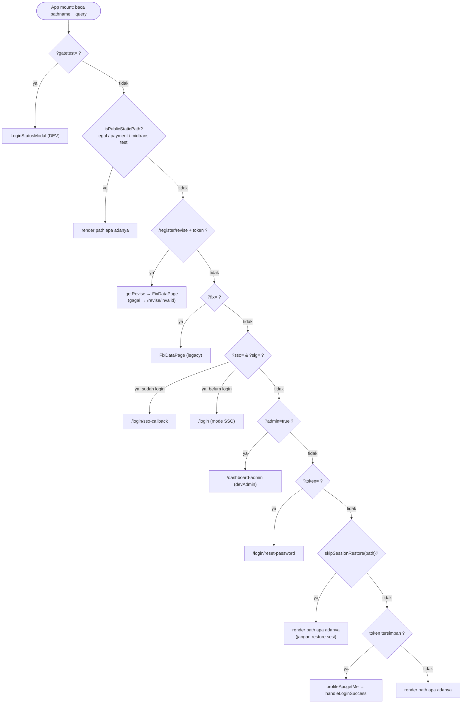
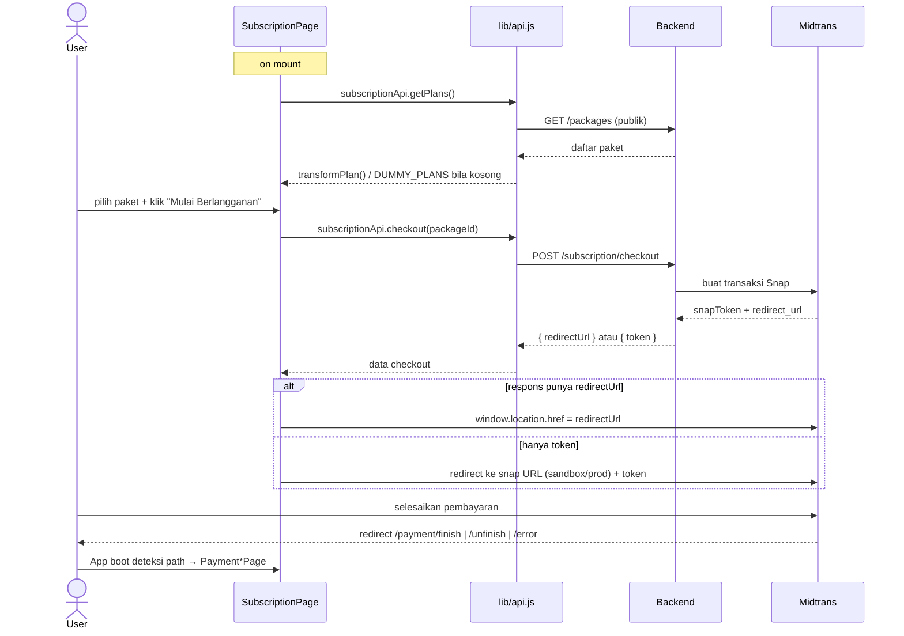

# GASING CIRCLE — Dokumentasi Arsitektur & Alur Data

> Dokumen ini melengkapi [`README.md`](README.md). README fokus ke **setup, deployment, dan referensi endpoint**; dokumen ini fokus ke **arsitektur internal, alur data antar-layer, dan detail fungsi**. Untuk daftar lengkap endpoint backend, lihat bagian [API Layer di README](README.md#9-api-layer).

**Stack:** React 18 (SPA) · Vite 5 · Tailwind + shadcn/ui · backend NestJS + Prisma + PostgreSQL (eksternal, via `VITE_API_URL`).

---

## Daftar Isi

1. [Gambaran Arsitektur](#1-gambaran-arsitektur)
2. [Layer & Tanggung Jawab](#2-layer--tanggung-jawab)
3. [Mesin Routing (`App.jsx`)](#3-mesin-routing-appjsx)
4. [Manajemen State](#4-manajemen-state)
5. [Data Layer — `lib/api.js`](#5-data-layer--libapijs)
6. [Sesi, Token & Refresh](#6-sesi-token--refresh)
7. [Alur Data per-Fitur](#7-alur-data-per-fitur)
8. [Dashboard Admin — Arsitektur Internal](#8-dashboard-admin--arsitektur-internal)
9. [Integrasi Eksternal](#9-integrasi-eksternal)
10. [Referensi Fungsi Kunci](#10-referensi-fungsi-kunci)
11. [Catatan & Utang Teknis](#11-catatan--utang-teknis)

---

## 1. Gambaran Arsitektur

Aplikasi adalah **Single Page Application murni client-side**. Tidak ada server-side rendering. Navigasi memakai **React Router v6** (`BrowserRouter` di `main.jsx`, `<Routes>` di `App.jsx`), dengan `base: '/'` — semua route adalah path absolut dari root domain. Peta URL terpusat di [`src/lib/routes.js`](src/lib/routes.js).

```
┌──────────────────────────────────────────────────────────────────────┐
│                            BROWSER (SPA)                                │
│                                                                        │
│   main.jsx ──► BrowserRouter ──► App.jsx (<Routes>) ──► Halaman aktif  │
│                   │                                                     │
│                   │ boot: baca pathname + query (deep-link, link email)│
│                   ▼                                                     │
│        ┌────────────────────┐   ┌─────────────────┐   ┌─────────────┐  │
│        │  Pages (auth/admin/ │   │  Components      │   │  Hooks       │  │
│        │  subscription/...)  │   │  (ui/layout/     │   │ useCountdown │  │
│        └─────────┬──────────┘   │   shared)        │   └─────────────┘  │
│                  │              └─────────────────┘                     │
│                  ▼                                                      │
│        ┌──────────────────────────────────────────────┐               │
│        │            lib/api.js  (data layer)            │               │
│        │  request() · tokenStorage · per-domain APIs    │               │
│        └───────────────────┬──────────────────────────┘               │
└────────────────────────────┼──────────────────────────────────────────┘
                             │ fetch (Authorization: Bearer …)
                             ▼
        ┌────────────────────────────────────────────────────┐
        │  Backend NestJS (VITE_API_URL)  ── PostgreSQL/Prisma│
        └──────┬──────────────────┬───────────────────┬───────┘
               │                  │                   │
               ▼                  ▼                   ▼
        Midtrans Snap      Discourse (SSO +     Gasing Web App
        (pembayaran)        komunitas)          (handoff token)
```

**Prinsip desain yang terlihat dari kode:**

- **URL = sumber kebenaran navigasi.** Setiap halaman punya path sendiri (`/login`, `/register`, `/dashboard-admin`, …). Refresh dan tombol back browser bekerja normal. Daftar path ada di `lib/routes.js`, bukan tersebar di komponen.
- **Page key masih dipakai sebagai alias.** File page memanggil `onNavigate("login")` seperti dulu; `App.jsx` menerjemahkannya lewat shim `go(key) → navigate(pathForPage(key))`. Jadi migrasi ke React Router tidak menyentuh isi tiap page.
- **Data layer terpusat.** Semua HTTP call lewat `lib/api.js`. Komponen tidak pernah memanggil `fetch` langsung (kecuali `window.snap.pay` untuk Midtrans).
- **State lokal, bukan global.** Tidak ada Redux/Zustand. State hidup di komponen masing-masing. `AuthContext` ada tapi **tidak dipakai** di `App.jsx` (lihat [Catatan](#11-catatan--utang-teknis)).
- **Halaman besar dipecah jadi komponen kecil.** Lihat refactoring v2.5.0 di README — semua file < 200 baris.

---

## 2. Layer & Tanggung Jawab

| Layer | Lokasi | Tanggung jawab |
| ----- | ------ | -------------- |
| **Entry** | `main.jsx` | Mount React ke `#root` dalam `StrictMode`. |
| **Router + Session** | `App.jsx` | Baca deep-link, cek sesi, pilih halaman, pegang state lintas-halaman (token sementara, user). |
| **Pages** | `pages/` | Satu file = satu layar. Memegang form state & memanggil data layer. |
| **Components** | `components/ui`, `layout`, `shared` | UI reusable. `ui/` = shadcn primitives; `layout/` = struktur; `shared/` = widget lintas-halaman. |
| **Hooks** | `hooks/useCountdown.js` | Logika timer (OTP & resend). |
| **Data layer** | `lib/api.js` | Wrapper `fetch`, token, refresh, semua endpoint per-domain. |
| **Utilities** | `lib/utils.js` (`cn`), `lib/fixLink.js` (encode/decode link perbaikan data), `lib/roles.js` (aturan peran) | Helper murni tanpa side-effect (kecuali `buildFixUrl` yang baca `window.location`). |
| **Context (unused)** | `context/AuthContext.jsx` | Alternatif auth global — tidak di-wire ke pohon komponen saat ini. |

---

## 3. Mesin Routing (`App.jsx` + `lib/routes.js`)

### 3.1 Cara kerja

`App.jsx` merender satu `<Routes>` berisi seluruh path aplikasi. Navigasi = `navigate('/path')` dari React Router.

```jsx
<Routes>
  <Route path="/" element={<Navigate to="/login" replace />} />
  <Route path="/login" element={<SplitLayout><LoginPage onNavigate={go} … /></SplitLayout>} />
  <Route path="/login/subscription" element={requireAuth(<SubscriptionPage … />)} />
  <Route path="/dashboard-admin" element={requireAuth(<Suspense><AdminDashboardPage … /></Suspense>)} />
  <Route path="*" element={<Navigate to="/login" replace />} />   {/* fail-safe */}
</Routes>
```

Dua helper penting:

| Helper | Lokasi | Guna |
| ------ | ------ | ---- |
| `go(key)` | `App.jsx` | Shim: page key lama → URL. `go("login")` → `navigate("/login")`. Page tetap memanggil `onNavigate("<key>")` seperti era state-router. |
| `requireAuth(element)` | `App.jsx` | Route bersesi. Tanpa access token → `<Navigate to="/login" replace />`. Di-bypass oleh `devAdmin` (`?admin=true`). |

`pathForPage(key)` di `lib/routes.js` adalah peta key→path (fail-safe ke `/login` untuk key tak dikenal).

### 3.2 Tabel route

| Path | Komponen | Layout | Sesi |
| ---- | -------- | ------ | ---- |
| `/` | → redirect `/login` | — | — |
| `/login` | `LoginPage` | split (LeftPanel) | publik |
| `/login/forgot-password` | `ForgotPasswordPage` | dark full-bleed | publik |
| `/login/check-email` | `CheckEmailPage` | dark full-bleed | publik |
| `/login/reset-password` | `ResetPasswordPage` | dark full-bleed | publik (token dari email) |
| `/login/choice` | `AuthChoicePage` | split | **butuh sesi** |
| `/login/sso-callback` | `SsoCallbackPage` | split | publik (param SSO) |
| `/login/subscription` | `SubscriptionPage` | full-screen | **butuh sesi** |
| `/login/subscription/transfer` | `TransferBankPage` | full-screen | **butuh sesi** + state `checkoutPlan` |
| `/register` | `SignUpPage` (2 step internal) | split | publik |
| `/register/otp` | `SignUpOtpPage` | split | publik |
| `/register/review` | `SignUpReviewPage` | dark full-bleed | publik |
| `/register/revise` | `FixDataPage` (token `/revise`, atau legacy `?fix=`) | split | publik (token dari email) |
| `/register/revise/invalid` | `ReviseErrorPage` (inline di `App.jsx`) | split | publik |
| `/register/id/TOS` | `TermsPage` | legal | publik |
| `/register/id/privacy` | `PrivacyPage` | legal | publik |
| `/register/reset-password` | → redirect `/login/reset-password` (+`search`) | — | kompat link email lama |
| `/dashboard-admin` | `AdminDashboardPage` (lazy + `Suspense`) | full-screen | **butuh sesi** |
| `/admin-dashboard` | → redirect `/dashboard-admin` | — | kompat path lama |
| `/payment/success` | `PaymentSuccessPage` | full-screen | publik |
| `/payment/finish` `/unfinish` `/error` | `PaymentFinish/Unfinish/Error Page` | full-screen | publik (landing Midtrans) |
| `/midtrans-test` | `MidtransTestPage` | full-screen | publik (dev tool) |
| `*` | → redirect `/login` | — | — |

`AdminDashboardPage` di-`lazy()` (code-split) agar bundle awal ringan; ditampilkan dengan `DashboardSpinner` sebagai fallback.

### 3.3 Boot sequence (`useEffect` di mount)

Router menangani path biasa. Boot sequence hanya menangani **hal yang butuh kerja sebelum render**: query param dari link eksternal (email, Midtrans, Discourse) dan restore sesi. Urutan **return-early** — yang pertama cocok menang:

```
1. ?gatetest=suspended|pending|expired  → DEV: paksa LoginStatusModal, tanpa backend
2. isPublicStaticPath(path)             → legal / /payment/* / /midtrans-test → render apa adanya, tanpa cek sesi
3. path /register/revise + ?token=<JWT> → authApi.getRevise() → prefill FixDataPage
                                          (gagal → /register/revise/invalid)
4. ?fix=<payload>                       → decodeFixPayload → FixDataPage (LEGACY, ADR-0003)
5. ?midtrans-test=true                  → /midtrans-test
6. ?sso= & ?sig=                        → simpan param; sudah login → /login/sso-callback, else → /login (mode SSO)
7. ?admin=true                          → DEV: devAdmin=true → /dashboard-admin tanpa sesi
8. ?token= (+ ?email=)                  → /login/reset-password (link email; token dibuang dari URL)
9. ?payment=success (+ ?plan=)          → /payment/success (legacy Snap Redirect)
10. skipSessionRestore(path)            → halaman auth-entry (/register*, /login/{reset,forgot,check-email}):
                                          JANGAN auto-restore sesi
11. token akses tersimpan               → profileApi.getMe() → handleLoginSuccess(profile)
12. (selain itu)                        → biarkan router yang render path saat ini
```

> **Urutan penting:** cek `/register/revise` dan `?fix=` berada **sebelum** `?token=` (reset-password) karena link revisi juga membawa `?token=`; pembedanya adalah path.

> **`skipSessionRestore` (langkah 10) mencegah bug nyata:** user yang sedang mendaftar atau me-reset password, tapi masih menyimpan token akun lama di storage, dulu tiba-tiba dilempar ke dashboard. Prefix-nya ada di `lib/routes.js`.



Setelah resolusi, `setSessionChecked(true)` membuka render (`if (!sessionChecked) return null` mencegah flicker). Query param dibersihkan lewat `navigate(path, { replace: true })` — bukan `history.replaceState`, supaya history React Router tidak putus sinkron.

> **Konsekuensi deploy:** karena URL kini nyata, server **wajib** punya SPA fallback (semua path → `index.html`). Tanpa itu, refresh di `/dashboard-admin` = 404 dari Nginx. Lihat [DEPLOYMENT_GUIDE.md](DEPLOYMENT_GUIDE.md).

---

## 4. Manajemen State

### 4.1 State lintas-halaman (di `App.jsx`)

State ini "diangkat" ke `App.jsx` karena dipakai untuk mengoper data antar halaman saat berpindah:

| State | Diisi oleh | Dikonsumsi oleh |
| ----- | ---------- | --------------- |
| `otpToken`, `regEmail` | `SignUpPage` (via `onOtpToken`) | `SignUpOtpPage` |
| `fpEmail` | `ForgotPasswordPage` (via `onEmailSent`) | `CheckEmailPage` |
| `resetToken`, `resetEmail` | boot sequence (`?token=&email=`) | `ResetPasswordPage` |
| `ssoParams` | boot sequence (`?sso=&sig=`) | `SsoCallbackPage`, `LoginPage` (mode SSO) |
| `reviseData`, `reviseToken` | boot sequence (`/register/revise?token=` → `getRevise` → `normalizeRevise`) | `FixDataPage` |
| `fixData` | boot sequence (`?fix=`, LEGACY) | `FixDataPage` (fallback bila `reviseData` kosong) |
| `currentUser` | `handleLoginSuccess` | Subscription/TransferBank/PaymentSuccess/Admin |
| `activePlanName` | `handlePaymentSuccess` / `?plan=` | `PaymentSuccessPage` |
| `checkoutPlan`, `manualPayment` | `handleCheckoutManual` (dari `SubscriptionPage`) | `TransferBankPage` — deep-link tanpa state → redirect balik ke `/login/subscription` |
| `gate` | `evaluateLoginGate` (login & restore sesi) / `?gatetest=` | `LoginStatusModal` (suspended/pending/expired) |
| `devAdmin` | boot sequence (`?admin=true`) | bypass `requireAuth` untuk preview dashboard tanpa backend |
| `sessionChecked` | boot sequence | gate render (`null` sampai `true`) |

### 4.2 State lokal

Form state (email, password, dsb.), loading, error → **lokal di tiap page**. Dashboard admin punya state tabel/modal/toast sendiri (lihat §8).

### 4.3 State persisten (storage)

Hanya **token** yang persisten, lewat `tokenStorage`:
- `remember = true` → `localStorage` (bertahan lintas-sesi browser).
- `remember = false` → `sessionStorage` (hilang saat tab ditutup).

Pembacaan selalu cek `localStorage` dulu, lalu `sessionStorage`.

---

## 5. Data Layer — `lib/api.js`

Satu modul, mengekspor `tokenStorage` + objek API per-domain: `authApi`, `profileApi`, `regionsApi`, `trainingSessionsApi`, `trainingHistoriesApi`, `queueApi`, `appConfigApi`, `timezoneApi`, `subscriptionApi`, `voucherApi`, `discourseApi`, `webAppApi`, `fileManagerApi`, `skillsApi`, `adminApi`.

Tiga grup yang lebih baru dan gampang terlewat:

| Grup | Endpoint | Dipakai di |
| ---- | -------- | ---------- |
| `trainingHistoriesApi` | `/training-histories/*` — upload CSV peserta, list/detail import, patch/delete baris, `push` ke sistem | Tab Riwayat Pelatihan (impor peserta) |
| `queueApi` | `/queue/jobs/:id` | Polling status job impor peserta (async) |
| `appConfigApi` | `GET/POST /app-config/:key` | Tab Pendaftaran Trainer — **datanya disimpan sebagai app-config**, bukan tabel sendiri (lihat §8) |

### 5.1 Pipeline `request(endpoint, options)`

```
request(endpoint, { method, body, headers })
  │
  ├─ rakit headers: Content-Type/Accept JSON + Authorization Bearer (jika ada token)
  ├─ fetch(BASE_URL + endpoint, { ...options, body: JSON.stringify(body) })
  │
  ├─ jika status 401 DAN ada refresh token:
  │     tryRefreshToken()
  │       ├─ sukses → set token baru → ULANGI request sekali → handleResponse
  │       └─ gagal  → tokenStorage.clear() → window.location.href = "/" (paksa logout)
  │
  └─ handleResponse(res)
        ├─ res.json() (toleran: {} jika body kosong)
        ├─ !res.ok → lempar Error dengan pesan ter-flatten:
        │            data.message  ATAU  gabungan data.errors (array / object → values.flat)
        └─ res.ok  → kembalikan data
```

Karakteristik penting:
- **Auto-attach token** ke setiap request.
- **Auto-refresh + retry sekali** saat 401. Kalau refresh gagal → hard redirect ke `/` (full logout).
- **Normalisasi error** jadi `Error.message` string tunggal, sehingga komponen cukup `catch(e) → setError(e.message)`.
- Endpoint **publik** (`regions`, `training-sessions`, `timezones`, `packages`) memakai `fetch` langsung tanpa lewat `request()` — sengaja melewati auth/refresh karena tidak butuh token.

### 5.2 Helper internal

| Fungsi | Guna |
| ------ | ---- |
| `requestMultipart(endpoint, formData)` | Upload file (`file-manager/upload`) — tanpa `Content-Type` JSON agar boundary multipart benar. |
| `handleResponse(res)` | Parse + lempar error ter-normalisasi. |
| `tryRefreshToken()` | `POST /auth/refresh` dengan refresh token → simpan token baru. |
| `buildQuery(params)` | Bangun query string, buang nilai `undefined/null/""`. |

### 5.3 Konvensi pagination/filter

API admin & list bertoken pakai default `{ page, limit }` lewat `buildQuery` (mis. `getUsers` default `page:1, limit:100`; voucher/subscription/payment `limit:20`).

---

## 6. Sesi, Token & Refresh

### 6.1 Bentuk token (dari `POST /auth/login`)

```json
{ "accessToken": "…", "refreshToken": "…", "tokenType": "Bearer", "expiresIn": "2h" }
```

### 6.2 Siklus hidup

```
Login  ─► tokenStorage.setTokens(access, refresh, remember)
           │
Request ─► attach Bearer access
           │ 401?
           ├─ ya → /auth/refresh (pakai refresh) ─► token baru ─► retry
           │        └─ gagal ─► clear() ─► redirect "/"
           └─ tidak → lanjut
           │
Logout ─► tokenStorage.clear() (local + session)
```

### 6.3 Routing pasca-login — `handleLoginSuccess(user)`

Logika penentuan tujuan setelah login berhasil (juga dipakai saat boot bila token masih valid):

```
isSuperAdmin = user.superadmin === true || user.superAdmin === true
hasCapabilities = user.capabilities mengandung SEMUA dari ADMIN_CAPABILITIES:
    USER/DISCOURSE/CHANGE_GROUP, PACKAGE/MGMT, USER/VERIFY,
    USER/LIST, VOUCHER/MGMT, USER/DISCOURSE/MANAGE_EXTRA_GROUPS

if  (!isSuperAdmin && hasCapabilities) → admin-dashboard   (admin operasional)
elif (isSuperAdmin)                    → auth-choice        (super admin)
else:
     subscriptionApi.getStatus()
       hasActiveSubscription || subscription.status === 'active'
         ? auth-choice        (user dengan langganan aktif)
         : subscription       (user perlu berlangganan)
```

> Aturan ini sengaja: **hanya non-superadmin yang punya capabilities lengkap** yang masuk dashboard admin operasional; superadmin diarahkan ke halaman pilihan (`auth-choice`).

> **Implementasi:** sejak [ADR-0002](docs/adr/0002-refactor-junior-maintainability.md), aturan peran (`ADMIN_CAPABILITIES`, `isSuperAdmin`, `isOperationalAdmin`) dipindah ke modul murni [`src/lib/roles.js`](src/lib/roles.js). `handleLoginSuccess` di `App.jsx` tinggal memanggilnya. Ubah daftar capability cukup di `roles.js`.

---

## 7. Alur Data per-Fitur

### 7.1 Registrasi (Sign Up → OTP → Review)

```
SignUpPage (Step 1: akun)                 SignUpPage (Step 2: data diri)
  name, username, email, password   ─►    birthdate, lokasi, pelatihan, sekolah
  validasi lokal (regex username,           │
   email, aturan password live)             │ on mount: muat provinces + sessions
       │                                     │ cascade: provinsi → regencies (regionId)
       ▼                                     │ filter: tahun → bulan → sesi (lastTrainingSessionId)
  Step 2 ──────────────────────────────────►│
                                             ▼
                              authApi.register({
                                username, email, password, name, birthdate,
                                regionId, firstTrainingYear, firstTrainingMonth,
                                firstTrainingRegionId (← dari session terpilih), schoolName })
                                             │ → { token }
                                             ▼
                              onOtpToken(token, email) → navigate signup-otp
                                             ▼
SignUpOtpPage: useCountdown(600) ─► authApi.confirmEmail(otpToken, otp) ─► signup-review
```

Detail data-shaping di Step 2:
- **Lokasi:** dropdown bertingkat `regionsApi.list()` (provinsi) → `regionsApi.list({ type:'REGENCY', parentId })`. Nilai akhir yang dikirim = `regionId` (kab/kota).
- **Pelatihan:** dropdown *Kapan* (tahun→bulan) memfilter daftar `trainingSessionsApi.list()`, lalu *Dimana* memilih sesi. Saat submit, `firstTrainingYear/Month` diturunkan dari pilihan, dan `firstTrainingRegionId` diambil dari `session.regionId`. (Catatan: `lastTrainingSessionId` dipakai untuk UI, tapi payload register mengirim tahun/bulan/region, bukan id sesi — sesuai komentar di kode.)

### 7.2 Login

```
LoginPage → authApi.login(email, password)
          → tokenStorage.setTokens(access, refresh, remember)
          → profileApi.getMe()
          → onLoginSuccess(profile)  →  handleLoginSuccess (§6.3)
```

### 7.3 Lupa / Reset Password

```
ForgotPasswordPage → authApi.forgotPassword(email) → onEmailSent(email) → check-email
   (CheckEmailPage: tombol kirim ulang, useCountdown 30s)

[Email user] link: <origin>/register?token=<t>&email=<e>
   → boot sequence deteksi ?token= → reset-password
   → ResetPasswordPage → authApi.resetPassword(token, email, newPassword) → login
```

### 7.4 Discourse SSO (login via komunitas)

```
Discourse → redirect: /register?sso=<payload>&sig=<sig>
  → App boot: simpan ssoParams, bersihkan URL
       ├─ sudah ada token akses → page = sso-callback
       └─ belum                 → page = login (isSsoMode=true, user login dulu)
  → SsoCallbackPage: discourseApi.gateway(sso, sig)  [POST /discourse/gateway]
       → respons { redirectUrl } → window.location.href = redirectUrl (balik ke Discourse, sudah ter-login)
```

Arah sebaliknya (`discourseApi.ssoLogin`) meng-inisiasi SSO dari app: memanggil `/discourse/sso-login`, lalu redirect browser ke `redirectUrl` yang dikembalikan server.

### 7.5 Pembayaran (Subscription → Midtrans)

```
SubscriptionPage
  on mount: subscriptionApi.getPlans()  → transformPlan() per paket
            (gagal/empty → DUMMY_PLANS fallback)
  pilih paket → handleCheckout()
     → subscriptionApi.checkout(packageId)  [POST /subscription/checkout]
     → respons:
         ├─ redirectUrl / redirect_url  → window.location.href (Snap Redirect)
         └─ token / snapToken           → bangun URL snap (sandbox vs prod) → redirect
  Midtrans selesai → redirect ke /payment/finish | /payment/unfinish | /payment/error
     → App boot deteksi path → PaymentFinish/Unfinish/Error Page
```

Sebagai sequence diagram:



> **Catatan implementasi:** alur produksi memakai **Snap Redirect** (`window.location.href`) + landing pages `/payment/*`, bukan Snap **Popup**. `window.snap.pay` hanya dipakai di `MidtransTestPage` (dev tool). README §10 sudah diselaraskan dengan perilaku ini.

### 7.6 Pembayaran Transfer Manual (Transfer Bank)

Jalur kedua di samping Midtrans: user transfer sendiri ke rekening perusahaan, unggah bukti, admin verifikasi.

```
SubscriptionPage → pilih paket → metode "Transfer Bank"
  → subscriptionApi.checkoutManual(packageId)   [POST /subscription/checkout/manual]
  → { payment } → onCheckoutManual(plan, payment) → /login/subscription/transfer

TransferBankPage
  isi: nama pengirim, bank asal, tanggal transfer, bukti transfer (file)
  → fileManagerApi.upload(file) → { fileId }
  → subscriptionApi.uploadReceipt(paymentId, fileId)
  → status payment jadi `receipt_uploaded` (menunggu review admin)

Admin (tab Verifikasi Pembayaran)
  → adminApi.listManualPayments({ filter: 'receipt_uploaded' })
  → approve → langganan aktif   |   reject (notes WAJIB) → status `rejected`
```

Detail modul admin-nya: [docs/VERIFIKASI_PEMBAYARAN.md](docs/VERIFIKASI_PEMBAYARAN.md).

> `TransferBankPage` butuh `checkoutPlan` + `manualPayment` dari state `App.jsx`. Deep-link langsung ke `/login/subscription/transfer` (state kosong, mis. setelah refresh) → redirect balik ke `/login/subscription`.

### 7.7 Perbaikan Data (akun ditolak admin)

Link **self-contained** — semua data ada di URL, tidak butuh DB lookup di FE:

```
Admin reject (RejectModal) → centang field yang salah + catatan
  → handleConfirmReject: buildFixUrl({ uid, …data, invalid:[…], notes }) (fixLink.js)
  → correctionUrl di-base64url, dikirim ke backend (verifyUser → backend email-kan ke user)

[Email user] <origin>/?fix=<payload>
  → App boot: decodeFixPayload(payload) → fixData → FixDataPage
  → FixDataPage: prefill form + tandai field invalid (FIELD_DEFS) → resubmit
```

`fixLink.js` menyediakan `encode/decodeFixPayload` (base64url unicode-safe), `buildFixUrl`, registry `FIELD_DEFS` (sumber kebenaran tunggal untuk checklist reject & bubble error), dan `defaultFieldMessage`.

---

## 8. Dashboard Admin — Arsitektur Internal

`AdminDashboardPage.jsx` adalah **orchestrator**: memegang semua state, memuat data, dan merakit sub-komponen per tab. **Lima tab** (urutan sidebar di `AdminSidebar.jsx`):

| Tab (`activeTab`) | Judul | Sumber data | Dokumen |
| ----------------- | ----- | ----------- | ------- |
| `verifikasi` | Verifikasi Akun | `adminApi.getUsers({ verifiedStatus: 0 })` — 2 sub-tab: `pending` & `voucher` (`PENDING_VOUCHER`) | — |
| `verifikasi-pembayaran` | Verifikasi Pembayaran | `adminApi.listManualPayments()` — 2 sub-tab: `receipt_uploaded` & `rejected` | [VERIFIKASI_PEMBAYARAN.md](docs/VERIFIKASI_PEMBAYARAN.md) |
| `manajemen` | Manajemen Akun | `adminApi.getUsers({})` | [MANAJEMEN_AKUN.md](docs/MANAJEMEN_AKUN.md) |
| `riwayat-pelatihan` | Riwayat Pelatihan | `trainingSessionsApi.list()` → `mapToRiwayat` | — |
| `pendaftaran-trainer` | Pendaftaran Pelatihan Trainer | `appConfigApi.get(PENDAFTARAN_KEY)` | — |

### 8.1 Pemuatan & transformasi data

```
loadUsers(tab):
  regionsApi.list()  (sekali, untuk resolve nama region)
  tab 'verifikasi'  → adminApi.getUsers({ verifiedStatus: 0 })
                      → filter pending → map mapToVerifikasi(u, regions)
  tab 'manajemen'   → adminApi.getUsers({})
                      → map mapToManajemen(u, regions)
discourseApi.getGroups() (sekali) → opsi role/grup

loadPembayaran():   adminApi.listManualPayments({ filter:'receipt_uploaded' }) → mapToPembayaran
                    adminApi.listManualPayments({ filter:'rejected' })          → mapToPembayaran
                    (try/catch terpisah: gagal di satu sub-tab tidak mengosongkan yang lain)

loadRiwayat():      trainingSessionsApi.list({ page:1, limit:100 }) → mapToRiwayat

loadPendaftaran():  appConfigApi.get(PENDAFTARAN_KEY) → threadsToRows → autoOffExpired
                    (kalau ada yang lewat batas waktu, status dinormalisasi lalu
                     ditulis balik via appConfigApi.set — supaya Home tidak menampilkan
                     pendaftaran yang sudah tutup)
```

> **Jangan tambah loop fetch per-baris di `loadRiwayat`.** Versi lama meresolve region (`GET /regions/:id`) dan ringkasan peserta per session → ~200 request untuk 100 session → NestJS throttler membalas **429**. Kolom "Daerah" & "Peserta" harus di-**embed backend** di respons list, bukan disintesis lewat N+1 fetch dari FE.

**Pendaftaran Trainer tersimpan di `app-config`, bukan tabel sendiri.** Baris tabel di-serialisasi ke satu value JSON (`threadsToRows` / `rowsToValue`). Konsekuensinya: tidak ada paginasi server, tidak ada audit trail, dan tulis = ganti seluruh value.

`mappers.js` menormalkan respons API yang "berantakan" ke bentuk UI rata:
- **Tanggal** bisa berupa `{ date, formatted }` atau `{ unix }` → `parseBirthdate`, `parseCreatedAtYear/Ms`, `fmtDate` (locale `id-ID`).
- **`verifiedStatus`** numerik (`1`=Approved, `-1`=Rejected, else Pending) → `parseVerifiedStatus`.
- **`mapToManajemen`** juga menurunkan status langganan, badge "baru" (< 7 hari), voucher aktif, dan plan.
- **`raw`** (di `mapToVerifikasi`) menyimpan id mentah untuk membangun `correctionUrl` saat reject.

### 8.2 Pola UX: optimistic update + undo + scheduled commit

Approve/reject/hapus memakai pola **optimistic + jendela undo 5 detik** sebelum benar-benar memanggil API:

```
handleConfirmApprove / handleConfirmReject:
  1. hapus baris dari state (optimistic)
  2. tampilkan toast "disetujui/ditolak" dengan tombol Batalkan
  3. scheduleAction(apiCall, onError):
        executeActionRef = true
        setTimeout 5000:
           jika masih true → apiCall()  (commit ke backend)
                             gagal → kembalikan baris + tampilkan error
  handleUndoToast: executeActionRef = false + kembalikan baris  → API tak pernah dipanggil
```

`scheduleAction` + `executeActionRef` adalah inti mekanisme: undo bekerja dengan **membatalkan timer commit**, bukan meng-undo panggilan server. Pola yang sama dipakai `handleDeleteRiwayat` (undo mengembalikan baris ke index semula via `splice`).

### 8.3 Tabel: filter, search, sort, export

- **Filter** (tab manajemen): `activeFilter` (status), `selectedRoles`, `selectedSubscriptions`.
- **Search**: cocokkan query ke `name/username/email/training/school/voucher`.
- **Sort**: hook lokal `useSort()` → `applySortToList()` (tanggal di-`getTime()`, string di-lowercase).
- **Export CSV**: `buildCsvContent(tab, users)` (escaping koma/kutip/newline) → `Blob` → download. Riwayat & satu-baris riwayat punya export sendiri.
- **Ukuran & scroll**: semua tabel memakai satu helper `getTableScrollProps()` (header + N baris terlihat, sisanya scroll, header sticky). Detail di [docs/ADMIN_TABLE_SCROLL.md](docs/ADMIN_TABLE_SCROLL.md).

### 8.4 Komponen anak

| Komponen | Peran |
| -------- | ----- |
| `AdminSidebar` | Navigasi 5 tab + sign out + titik biru penanda item baru (`navFlags`). |
| `TableControls.jsx` | Toolbar per tab: `VerifikasiControls`, `ManajemenControls`, `PendaftaranTrainerControls`, `RiwayatPelatihanControls` (search/filter/export/add). |
| `VerifikasiTable` / `PendingVoucherTable` | Tab Verifikasi Akun — sub-tab `pending` & `voucher` (`PENDING_VOUCHER`). |
| `VerifikasiPembayaranTable` + `PembayaranModals` | Tab Verifikasi Pembayaran — konfirmasi / tolak bukti transfer. |
| `ManajemenTable` | Tab Manajemen Akun. |
| `RiwayatPelatihanTable` / `PendaftaranTrainerTable` | Tab Riwayat Pelatihan / Pendaftaran Trainer. |
| `SetujuiAkunModal` / `RejectModal`+`ApproveModal` (`ConfirmModal.jsx`) | Verifikasi akun (langkah 1 → `PENDING_VOUCHER`). |
| `BulkApproveModal` / `BulkRejectModal` / `VoucherModals` | Aksi massal + voucher ([ADMIN_TABLE_LIMITS.md](docs/ADMIN_TABLE_LIMITS.md)). |
| `UbahRoleModal` / `KirimVoucherModal` / `SuspendModal` / `AccountActionModals` | Aksi pada tab Manajemen (role, voucher, tangguhkan, hapus/pulihkan). |
| `AddPelatihanModal` / `PerbaruiRiwayatModal` / `DaftarPesertaModal` / `EditPesertaModal` | Tambah & perbarui pelatihan, kelola peserta. |
| `AddPendaftaranTrainerModal` / `HapusRiwayatModal` | Tambah pendaftaran / hapus riwayat (ketik `DELETE`). |
| `AdminToast` | Toast undo 5 detik. |

> **Verifikasi akun = 2 call terpisah.** `WAITING` → *Setujui* → `PENDING_VOUCHER` → *kirim voucher* → `APPROVED`. Langkah kedua mengirim **`{ status }` saja**.

---

## 9. Integrasi Eksternal

| Integrasi | Modul | Mekanisme |
| --------- | ----- | --------- |
| **Midtrans** | `subscriptionApi.checkout` + `index.html` snap.js + `MidtransTestPage` | Snap Redirect (produksi flow) / Snap Popup `window.snap.pay` (dev tool). Client key di `index.html`; landing `/payment/*`. |
| **Discourse SSO** | `discourseApi.gateway` / `ssoLogin` | Verifikasi `sso+sig`, redirect handoff. |
| **Gasing Web App** | `webAppApi.redirectWithTokens()` | Handoff sesi ke `gasing.vercel.app/api/auth/callback?token=&refresh=`. |
| **File Manager** | `fileManagerApi` | Upload multipart → commit → download URL. |

---

## 10. Referensi Fungsi Kunci

### `lib/api.js`
- `tokenStorage.{getAccess,getRefresh,setTokens,clear}` — abstraksi storage token (local/session).
- `request(endpoint, options)` — pipeline fetch + auth + refresh + error-normalize.
- `tryRefreshToken()` — perbarui access token; `false` bila gagal.
- `buildQuery(params)` — query string bersih.
- `webAppApi.redirectWithTokens()` — serahkan token ke web app via URL.

### `App.jsx`
- `init()` (useEffect) — boot sequence/deep-link (§3.2).
- `handleLoginSuccess(user)` — routing berbasis capability/superadmin/langganan (§6.3).
- `handleOtpToken`, `handleEmailSent`, `handlePaymentSuccess`, `handleSignOut` — jembatan state antar-halaman.

### `pages/admin/mappers.js`
- `mapToVerifikasi(u, regions)` / `mapToManajemen(u, regions)` — API → bentuk UI.
- `parseBirthdate` / `parseCreatedAtYear` / `parseCreatedAtMs` / `parseVerifiedStatus` / `fmtDate` — normalisasi field.

### `pages/AdminDashboardPage.jsx`
- `loadUsers(tab)` — fetch + map per tab.
- `scheduleAction(apiCall, onError)` + `executeActionRef` — commit tertunda + undo.
- `applySortToList`, `buildCsvContent`, `useSort` — tabel util.

### `lib/fixLink.js`
- `encodeFixPayload` / `decodeFixPayload` / `buildFixUrl` — link perbaikan data self-contained.
- `FIELD_DEFS` / `FIELD_LABEL` / `defaultFieldMessage` — registry field.

### `hooks/useCountdown.js`
- `useCountdown(seconds)` → `{ display "MM:SS", expired, reset() }`.

### `pages/SubscriptionPage.jsx`
- `transformPlan(pkg)` — paket API → kartu UI (deteksi annual/monthly).
- `handleCheckout()` — checkout + redirect Midtrans.

---

## 11. Catatan & Utang Teknis

Hal yang **tidak konsisten / perlu diketahui maintainer** (ditemukan langsung dari kode, bukan dari README):

1. **`AuthContext.jsx` tidak terpakai.** `App.jsx` mengelola auth sendiri (`currentUser` + `handleLoginSuccess`). `AuthProvider`/`useAuth` ada tapi tidak membungkus `<App/>` di `main.jsx`. Pilih salah satu agar tidak membingungkan.
2. **Midtrans: Popup vs Redirect.** Alur produksi (`SubscriptionPage`) memakai Snap **Redirect** + landing `/payment/*`; `window.snap.pay` (Popup) hanya di `MidtransTestPage` (dev tool). README §10 sudah diperbarui agar sesuai — pastikan perubahan implementasi di masa depan ikut menyelaraskan kedua dokumen ini.
3. **Routing sudah pindah ke React Router v6 + `base: '/'`** (dulu state-based tanpa URL). Konsekuensi yang masih perlu ditindaklanjuti: **Nginx wajib punya SPA fallback** untuk semua path, bukan cuma `/register`. Config di `deploy/` belum tentu ter-deploy di semua environment — lihat [DEPLOYMENT_GUIDE.md](DEPLOYMENT_GUIDE.md). Link email lama (`/register/reset-password`) ditangani route redirect kompatibilitas di `App.jsx`.
4. **Page key masih dipakai** (`onNavigate("login")`) walau routing sudah URL-based, disambung shim `go()` + `pathForPage()`. Sengaja, supaya migrasi tidak menyentuh 20+ file page — tapi berarti ada **dua kosakata navigasi** yang harus dijaga sinkron di `lib/routes.js`.
5. **Alur revisi data kini token-based** (`revise`): admin `reviseUser`/`rejectUser`, user via link `/register/revise?token=` → `getRevise`/`submitRevise`. Endpoint sudah ada di backend. Legacy `?fix=` + `submitCorrection` masih di kode sebagai fallback **deprecated** — hapus setelah stabil. Lihat [ADR-0003](docs/adr/0003-revise-token-flow.md) & [FIX_DATA_FLOW.md](docs/FIX_DATA_FLOW.md).
6. **`normalizeRevise` masih menebak nama field.** Ada `TODO(verify)` di `App.jsx` — bentuk respons `/auth/revise` belum dikonfirmasi ke backend; normalizer membaca beberapa alias (`user`/`profile`/`data`, `reviseFields`/`fieldsToRevise`) sebagai jaring pengaman.
7. **Data admin sudah live, dengan catatan.** Riwayat Pelatihan kini dari `trainingSessionsApi.list()` — tapi kolom **Daerah** & **Peserta** menunggu backend meng-embed-nya di respons list (N+1 fetch dari FE memicu 429, jangan diulang). Pendaftaran Trainer disimpan di **`app-config`**, bukan tabel — tanpa paginasi/audit trail, tulis = ganti seluruh value.
8. **Nama field region pelatihan sudah diselaraskan ke `firstTrainingRegionId`** (nama kanonik yang dikirim registrasi). `mappers.js` kini membaca `firstTrainingRegionId` dengan fallback ke `trainingRegionId` lama, jadi aman untuk kedua bentuk respons API. Bila respons asli memakai nama lain lagi, ubah di `mapToVerifikasi`/`mapToManajemen`.
9. **401 → hard redirect `/`.** Saat refresh token gagal, `request()` memaksa `window.location.href = "/"`. Dengan `base: '/'`, `/` diarahkan router ke `/login` — perilaku benar, tapi ini reload penuh (state hilang), bukan navigasi React Router.
10. **Kode mati di `AccountActionModals.jsx`.** Mengekspor `SetujuiAkunModal` & `TangguhkanAkunModal` yang tidak diimpor di mana pun; versi aktif ada di `SetujuiAkunModal.jsx` & `SuspendModal.jsx`.
11. **`bad-words` dipin di v3.** Jangan upgrade ke 4.x — tarball-nya tanpa `dist/`, dev jalan tapi `npm run build` mati.

---

© 2026 Sarang Gasing. Dokumen arsitektur internal — pendamping [`README.md`](README.md).
