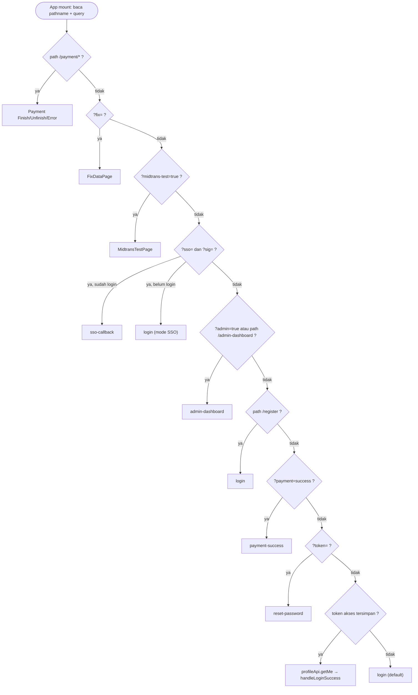
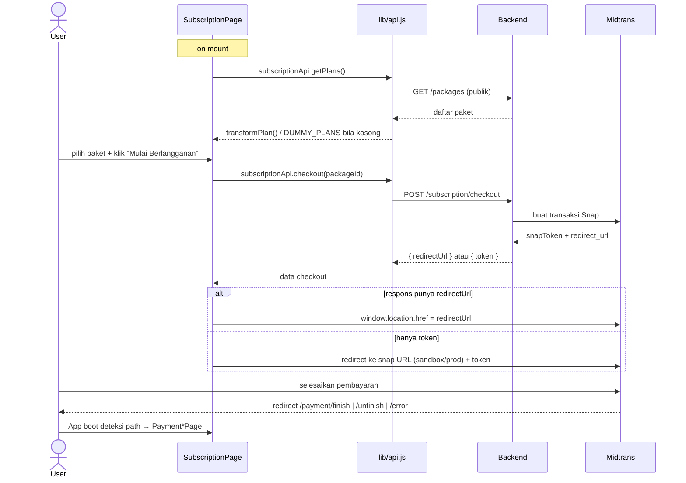

# GASING CIRCLE — Dokumentasi Arsitektur & Alur Data

> Dokumen ini melengkapi [`README.md`](README.md). README fokus ke **setup, deployment, dan referensi endpoint**; dokumen ini fokus ke **arsitektur internal, alur data antar-layer, dan detail fungsi**. Untuk daftar lengkap endpoint backend, lihat bagian [API Layer di README](README.md#9-api-layer).

**Stack:** React 18 (SPA) · Vite 5 · Tailwind + shadcn/ui · backend NestJS + Prisma + PostgreSQL (eksternal, via `VITE_API_URL`).

---

## Daftar Isi

1. [Gambaran Arsitektur](#1-gambaran-arsitektur)
2. [Layer & Tanggung Jawab](#2-layer--tanggung-jawab)
3. [Mesin Routing (`App.jsx`)](#3-mesin-routing-appjsx)
4. [Manajemen State](#4-manajemen-state)
5. [Data Layer — `lib/api.js`](#5-data-layer--libapijs)
6. [Sesi, Token & Refresh](#6-sesi-token--refresh)
7. [Alur Data per-Fitur](#7-alur-data-per-fitur)
8. [Dashboard Admin — Arsitektur Internal](#8-dashboard-admin--arsitektur-internal)
9. [Integrasi Eksternal](#9-integrasi-eksternal)
10. [Referensi Fungsi Kunci](#10-referensi-fungsi-kunci)
11. [Catatan & Utang Teknis](#11-catatan--utang-teknis)

---

## 1. Gambaran Arsitektur

Aplikasi adalah **Single Page Application murni client-side**. Tidak ada server-side rendering, tidak ada library router (React Router). Navigasi dikelola sendiri lewat satu state `page` di `App.jsx` (state-based router).

```
┌──────────────────────────────────────────────────────────────────────┐
│                            BROWSER (SPA)                                │
│                                                                        │
│   main.jsx ──► App.jsx (state router) ──► Halaman aktif (1 komponen)   │
│                   │                                                     │
│                   │ baca window.location (path + query) sekali di boot │
│                   ▼                                                     │
│        ┌────────────────────┐   ┌─────────────────┐   ┌─────────────┐  │
│        │  Pages (auth/admin/ │   │  Components      │   │  Hooks       │  │
│        │  subscription/...)  │   │  (ui/layout/     │   │ useCountdown │  │
│        └─────────┬──────────┘   │   shared)        │   └─────────────┘  │
│                  │              └─────────────────┘                     │
│                  ▼                                                      │
│        ┌──────────────────────────────────────────────┐               │
│        │            lib/api.js  (data layer)            │               │
│        │  request() · tokenStorage · per-domain APIs    │               │
│        └───────────────────┬──────────────────────────┘               │
└────────────────────────────┼──────────────────────────────────────────┘
                             │ fetch (Authorization: Bearer …)
                             ▼
        ┌────────────────────────────────────────────────────┐
        │  Backend NestJS (VITE_API_URL)  ── PostgreSQL/Prisma│
        └──────┬──────────────────┬───────────────────┬───────┘
               │                  │                   │
               ▼                  ▼                   ▼
        Midtrans Snap      Discourse (SSO +     Gasing Web App
        (pembayaran)        komunitas)          (handoff token)
```

**Prinsip desain yang terlihat dari kode:**

- **Satu sumber navigasi.** `App.jsx` memegang `page` (string) dan memilih komponen mana yang dirender. Tidak ada URL berubah saat navigasi internal — URL hanya dibaca **sekali** saat boot untuk menentukan halaman awal (deep-link), lalu query param dibersihkan dengan `history.replaceState`.
- **Data layer terpusat.** Semua HTTP call lewat `lib/api.js`. Komponen tidak pernah memanggil `fetch` langsung (kecuali `window.snap.pay` untuk Midtrans).
- **State lokal, bukan global.** Tidak ada Redux/Zustand. State hidup di komponen masing-masing. `AuthContext` ada tapi **tidak dipakai** di `App.jsx` (lihat [Catatan](#11-catatan--utang-teknis)).
- **Halaman besar dipecah jadi komponen kecil.** Lihat refactoring v2.5.0 di README — semua file < 200 baris.

---

## 2. Layer & Tanggung Jawab

| Layer | Lokasi | Tanggung jawab |
| ----- | ------ | -------------- |
| **Entry** | `main.jsx` | Mount React ke `#root` dalam `StrictMode`. |
| **Router + Session** | `App.jsx` | Baca deep-link, cek sesi, pilih halaman, pegang state lintas-halaman (token sementara, user). |
| **Pages** | `pages/` | Satu file = satu layar. Memegang form state & memanggil data layer. |
| **Components** | `components/ui`, `layout`, `shared` | UI reusable. `ui/` = shadcn primitives; `layout/` = struktur; `shared/` = widget lintas-halaman. |
| **Hooks** | `hooks/useCountdown.js` | Logika timer (OTP & resend). |
| **Data layer** | `lib/api.js` | Wrapper `fetch`, token, refresh, semua endpoint per-domain. |
| **Utilities** | `lib/utils.js` (`cn`), `lib/fixLink.js` (encode/decode link perbaikan data), `lib/roles.js` (aturan peran) | Helper murni tanpa side-effect (kecuali `buildFixUrl` yang baca `window.location`). |
| **Context (unused)** | `context/AuthContext.jsx` | Alternatif auth global — tidak di-wire ke pohon komponen saat ini. |

---

## 3. Mesin Routing (`App.jsx`)

### 3.1 Cara kerja

`App.jsx` adalah **state machine** dengan satu variabel utama `page`. Render-nya berupa rangkaian early-return (`if (page === …) return <X/>`), lalu fallback ke "split-layout pages" (login/signup) yang dibungkus `LeftPanel`.

```jsx
const [page, setPage] = useState("login");
...
if (page === "payment-finish")   return <PaymentFinishPage />;
if (page === "subscription")     return <SubscriptionPage .../>;
if (page === "admin-dashboard")  return <Suspense><AdminDashboardPage .../></Suspense>;
...
return <div className="flex h-screen"><LeftPanel/>{authPages[page] ?? authPages["login"]}</div>;
```

Setiap halaman menerima `onNavigate={setPage}` sebagai cara berpindah. Jadi "navigasi" = memanggil `setPage('nama-route')`.

### 3.2 Boot sequence (`useEffect` di mount)

Urutan deteksi **berurutan dan return-early** — yang pertama cocok menang:

```
1. path /payment/finish|unfinish|error   → halaman landing Midtrans (Snap Redirect)
2. path /revise + ?token=<JWT>            → getRevise → FixDataPage (revisi data, token-based)
3. ?fix=<payload>                          → decode → FixDataPage (LEGACY, deprecated — lihat ADR-0003)
4. ?midtrans-test=true                     → MidtransTestPage (dev tool)
5. ?sso=&sig=                              → simpan param; jika sudah login → sso-callback, else → login (SSO mode)
6. ?admin=true  ATAU path /admin-dashboard → admin-dashboard
7. path /register                          → login (entry point produksi)
8. ?payment=success (+ ?plan=)             → payment-success
9. ?token= (+ ?email=)                     → reset-password (link dari email)
10. token akses tersimpan                  → profileApi.getMe() → handleLoginSuccess(profile)
11. (default)                              → login
```

> **Urutan penting:** cek `/revise` dan `?fix=` berada **sebelum** `?token=`
> (reset-password) karena link revisi juga membawa `?token=`; pembeda-nya path `/revise`.

Direpresentasikan sebagai pohon keputusan (yang pertama cocok menang, sisanya tidak dievaluasi):



Setelah resolusi, `setSessionChecked(true)` membuka render (`if (!sessionChecked) return null` mencegah flicker). Query param dibersihkan via `clearUrlParams()` (`history.replaceState`).

> **Penting:** Karena URL tidak berubah saat navigasi internal, **refresh browser selalu kembali ke hasil boot sequence** (umumnya login/sesi), bukan ke halaman terakhir.

### 3.3 Tabel route

| `page` | Komponen | Layout |
| ------ | -------- | ------ |
| `login` | `LoginPage` | split (LeftPanel + RightPanel) |
| `signup` | `SignUpPage` (2 step internal) | split |
| `fix-data` | `FixDataPage` (revisi via token `/revise`, atau legacy `?fix=`) | split |
| `revise-error` | inline (link revisi invalid/expired) | split |
| `signup-otp` | `SignUpOtpPage` | split |
| `signup-review` | `SignUpReviewPage` | split |
| `auth-choice` | `AuthChoicePage` | split |
| `sso-callback` | `SsoCallbackPage` | split |
| `forgot-password` | `ForgotPasswordPage` | full-screen |
| `check-email` | `CheckEmailPage` | full-screen |
| `reset-password` | `ResetPasswordPage` | full-screen |
| `subscription` | `SubscriptionPage` | full-screen |
| `payment-success` | `PaymentSuccessPage` | full-screen |
| `payment-finish` / `-unfinish` / `-error` | `PaymentFinish/Unfinish/Error Page` | full-screen |
| `admin-dashboard` | `AdminDashboardPage` (lazy + `Suspense`) | full-screen |
| `midtrans-test` | `MidtransTestPage` | full-screen |

`AdminDashboardPage` di-`lazy()` (code-split) agar bundle awal ringan; ditampilkan dengan spinner fallback.

---

## 4. Manajemen State

### 4.1 State lintas-halaman (di `App.jsx`)

State ini "diangkat" ke `App.jsx` karena dipakai untuk mengoper data antar halaman saat berpindah:

| State | Diisi oleh | Dikonsumsi oleh |
| ----- | ---------- | --------------- |
| `otpToken`, `regEmail` | `SignUpPage` (via `onOtpToken`) | `SignUpOtpPage` |
| `fpEmail` | `ForgotPasswordPage` (via `onEmailSent`) | `CheckEmailPage` |
| `resetToken`, `resetEmail` | boot sequence (`?token=&email=`) | `ResetPasswordPage` |
| `ssoParams` | boot sequence (`?sso=&sig=`) | `SsoCallbackPage`, `LoginPage` (mode SSO) |
| `fixData` | boot sequence (`?fix=`) | `FixDataPage` |
| `currentUser` | `handleLoginSuccess` | Subscription/PaymentSuccess/Admin |
| `activePlanName` | `handlePaymentSuccess` / `?plan=` | `PaymentSuccessPage` |
| `sessionChecked` | boot sequence | gate render |

### 4.2 State lokal

Form state (email, password, dsb.), loading, error → **lokal di tiap page**. Dashboard admin punya state tabel/modal/toast sendiri (lihat §8).

### 4.3 State persisten (storage)

Hanya **token** yang persisten, lewat `tokenStorage`:
- `remember = true` → `localStorage` (bertahan lintas-sesi browser).
- `remember = false` → `sessionStorage` (hilang saat tab ditutup).

Pembacaan selalu cek `localStorage` dulu, lalu `sessionStorage`.

---

## 5. Data Layer — `lib/api.js`

Satu modul, mengekspor `tokenStorage` + objek API per-domain (`authApi`, `profileApi`, `regionsApi`, `trainingSessionsApi`, `timezoneApi`, `subscriptionApi`, `voucherApi`, `discourseApi`, `webAppApi`, `fileManagerApi`, `skillsApi`, `adminApi`).

### 5.1 Pipeline `request(endpoint, options)`

```
request(endpoint, { method, body, headers })
  │
  ├─ rakit headers: Content-Type/Accept JSON + Authorization Bearer (jika ada token)
  ├─ fetch(BASE_URL + endpoint, { ...options, body: JSON.stringify(body) })
  │
  ├─ jika status 401 DAN ada refresh token:
  │     tryRefreshToken()
  │       ├─ sukses → set token baru → ULANGI request sekali → handleResponse
  │       └─ gagal  → tokenStorage.clear() → window.location.href = "/" (paksa logout)
  │
  └─ handleResponse(res)
        ├─ res.json() (toleran: {} jika body kosong)
        ├─ !res.ok → lempar Error dengan pesan ter-flatten:
        │            data.message  ATAU  gabungan data.errors (array / object → values.flat)
        └─ res.ok  → kembalikan data
```

Karakteristik penting:
- **Auto-attach token** ke setiap request.
- **Auto-refresh + retry sekali** saat 401. Kalau refresh gagal → hard redirect ke `/` (full logout).
- **Normalisasi error** jadi `Error.message` string tunggal, sehingga komponen cukup `catch(e) → setError(e.message)`.
- Endpoint **publik** (`regions`, `training-sessions`, `timezones`, `packages`) memakai `fetch` langsung tanpa lewat `request()` — sengaja melewati auth/refresh karena tidak butuh token.

### 5.2 Helper internal

| Fungsi | Guna |
| ------ | ---- |
| `requestMultipart(endpoint, formData)` | Upload file (`file-manager/upload`) — tanpa `Content-Type` JSON agar boundary multipart benar. |
| `handleResponse(res)` | Parse + lempar error ter-normalisasi. |
| `tryRefreshToken()` | `POST /auth/refresh` dengan refresh token → simpan token baru. |
| `buildQuery(params)` | Bangun query string, buang nilai `undefined/null/""`. |

### 5.3 Konvensi pagination/filter

API admin & list bertoken pakai default `{ page, limit }` lewat `buildQuery` (mis. `getUsers` default `page:1, limit:100`; voucher/subscription/payment `limit:20`).

---

## 6. Sesi, Token & Refresh

### 6.1 Bentuk token (dari `POST /auth/login`)

```json
{ "accessToken": "…", "refreshToken": "…", "tokenType": "Bearer", "expiresIn": "2h" }
```

### 6.2 Siklus hidup

```
Login  ─► tokenStorage.setTokens(access, refresh, remember)
           │
Request ─► attach Bearer access
           │ 401?
           ├─ ya → /auth/refresh (pakai refresh) ─► token baru ─► retry
           │        └─ gagal ─► clear() ─► redirect "/"
           └─ tidak → lanjut
           │
Logout ─► tokenStorage.clear() (local + session)
```

### 6.3 Routing pasca-login — `handleLoginSuccess(user)`

Logika penentuan tujuan setelah login berhasil (juga dipakai saat boot bila token masih valid):

```
isSuperAdmin = user.superadmin === true || user.superAdmin === true
hasCapabilities = user.capabilities mengandung SEMUA dari ADMIN_CAPABILITIES:
    USER/DISCOURSE/CHANGE_GROUP, PACKAGE/MGMT, USER/VERIFY,
    USER/LIST, VOUCHER/MGMT, USER/DISCOURSE/MANAGE_EXTRA_GROUPS

if  (!isSuperAdmin && hasCapabilities) → admin-dashboard   (admin operasional)
elif (isSuperAdmin)                    → auth-choice        (super admin)
else:
     subscriptionApi.getStatus()
       hasActiveSubscription || subscription.status === 'active'
         ? auth-choice        (user dengan langganan aktif)
         : subscription       (user perlu berlangganan)
```

> Aturan ini sengaja: **hanya non-superadmin yang punya capabilities lengkap** yang masuk dashboard admin operasional; superadmin diarahkan ke halaman pilihan (`auth-choice`).

> **Implementasi:** sejak [ADR-0002](docs/adr/0002-refactor-junior-maintainability.md), aturan peran (`ADMIN_CAPABILITIES`, `isSuperAdmin`, `isOperationalAdmin`) dipindah ke modul murni [`src/lib/roles.js`](src/lib/roles.js). `handleLoginSuccess` di `App.jsx` tinggal memanggilnya. Ubah daftar capability cukup di `roles.js`.

---

## 7. Alur Data per-Fitur

### 7.1 Registrasi (Sign Up → OTP → Review)

```
SignUpPage (Step 1: akun)                 SignUpPage (Step 2: data diri)
  name, username, email, password   ─►    birthdate, lokasi, pelatihan, sekolah
  validasi lokal (regex username,           │
   email, aturan password live)             │ on mount: muat provinces + sessions
       │                                     │ cascade: provinsi → regencies (regionId)
       ▼                                     │ filter: tahun → bulan → sesi (lastTrainingSessionId)
  Step 2 ──────────────────────────────────►│
                                             ▼
                              authApi.register({
                                username, email, password, name, birthdate,
                                regionId, firstTrainingYear, firstTrainingMonth,
                                firstTrainingRegionId (← dari session terpilih), schoolName })
                                             │ → { token }
                                             ▼
                              onOtpToken(token, email) → navigate signup-otp
                                             ▼
SignUpOtpPage: useCountdown(600) ─► authApi.confirmEmail(otpToken, otp) ─► signup-review
```

Detail data-shaping di Step 2:
- **Lokasi:** dropdown bertingkat `regionsApi.list()` (provinsi) → `regionsApi.list({ type:'REGENCY', parentId })`. Nilai akhir yang dikirim = `regionId` (kab/kota).
- **Pelatihan:** dropdown *Kapan* (tahun→bulan) memfilter daftar `trainingSessionsApi.list()`, lalu *Dimana* memilih sesi. Saat submit, `firstTrainingYear/Month` diturunkan dari pilihan, dan `firstTrainingRegionId` diambil dari `session.regionId`. (Catatan: `lastTrainingSessionId` dipakai untuk UI, tapi payload register mengirim tahun/bulan/region, bukan id sesi — sesuai komentar di kode.)

### 7.2 Login

```
LoginPage → authApi.login(email, password)
          → tokenStorage.setTokens(access, refresh, remember)
          → profileApi.getMe()
          → onLoginSuccess(profile)  →  handleLoginSuccess (§6.3)
```

### 7.3 Lupa / Reset Password

```
ForgotPasswordPage → authApi.forgotPassword(email) → onEmailSent(email) → check-email
   (CheckEmailPage: tombol kirim ulang, useCountdown 30s)

[Email user] link: <origin>/register?token=<t>&email=<e>
   → boot sequence deteksi ?token= → reset-password
   → ResetPasswordPage → authApi.resetPassword(token, email, newPassword) → login
```

### 7.4 Discourse SSO (login via komunitas)

```
Discourse → redirect: /register?sso=<payload>&sig=<sig>
  → App boot: simpan ssoParams, bersihkan URL
       ├─ sudah ada token akses → page = sso-callback
       └─ belum                 → page = login (isSsoMode=true, user login dulu)
  → SsoCallbackPage: discourseApi.gateway(sso, sig)  [POST /discourse/gateway]
       → respons { redirectUrl } → window.location.href = redirectUrl (balik ke Discourse, sudah ter-login)
```

Arah sebaliknya (`discourseApi.ssoLogin`) meng-inisiasi SSO dari app: memanggil `/discourse/sso-login`, lalu redirect browser ke `redirectUrl` yang dikembalikan server.

### 7.5 Pembayaran (Subscription → Midtrans)

```
SubscriptionPage
  on mount: subscriptionApi.getPlans()  → transformPlan() per paket
            (gagal/empty → DUMMY_PLANS fallback)
  pilih paket → handleCheckout()
     → subscriptionApi.checkout(packageId)  [POST /subscription/checkout]
     → respons:
         ├─ redirectUrl / redirect_url  → window.location.href (Snap Redirect)
         └─ token / snapToken           → bangun URL snap (sandbox vs prod) → redirect
  Midtrans selesai → redirect ke /payment/finish | /payment/unfinish | /payment/error
     → App boot deteksi path → PaymentFinish/Unfinish/Error Page
```

Sebagai sequence diagram:



> **Catatan implementasi:** alur produksi memakai **Snap Redirect** (`window.location.href`) + landing pages `/payment/*`, bukan Snap **Popup**. `window.snap.pay` hanya dipakai di `MidtransTestPage` (dev tool). README §10 sudah diselaraskan dengan perilaku ini.

### 7.6 Perbaikan Data (akun ditolak admin)

Link **self-contained** — semua data ada di URL, tidak butuh DB lookup di FE:

```
Admin reject (RejectModal) → centang field yang salah + catatan
  → handleConfirmReject: buildFixUrl({ uid, …data, invalid:[…], notes }) (fixLink.js)
  → correctionUrl di-base64url, dikirim ke backend (verifyUser → backend email-kan ke user)

[Email user] <origin>/?fix=<payload>
  → App boot: decodeFixPayload(payload) → fixData → FixDataPage
  → FixDataPage: prefill form + tandai field invalid (FIELD_DEFS) → resubmit
```

`fixLink.js` menyediakan `encode/decodeFixPayload` (base64url unicode-safe), `buildFixUrl`, registry `FIELD_DEFS` (sumber kebenaran tunggal untuk checklist reject & bubble error), dan `defaultFieldMessage`.

---

## 8. Dashboard Admin — Arsitektur Internal

`AdminDashboardPage.jsx` adalah **orchestrator**: memegang semua state, memuat data, dan merakit sub-komponen per tab. Empat tab: **Verifikasi**, **Manajemen**, **Pendaftaran Trainer**, **Riwayat Pelatihan**.

### 8.1 Pemuatan & transformasi data

```
loadUsers(tab):
  regionsApi.list()  (sekali, untuk resolve nama region)
  tab 'verifikasi'  → adminApi.getUsers({ verifiedStatus: 0 })
                      → filter pending → map mapToVerifikasi(u, regions)
  tab 'manajemen'   → adminApi.getUsers({})
                      → map mapToManajemen(u, regions)
discourseApi.getGroups() (sekali) → opsi role/grup
```

`mappers.js` menormalkan respons API yang "berantakan" ke bentuk UI rata:
- **Tanggal** bisa berupa `{ date, formatted }` atau `{ unix }` → `parseBirthdate`, `parseCreatedAtYear/Ms`, `fmtDate` (locale `id-ID`).
- **`verifiedStatus`** numerik (`1`=Approved, `-1`=Rejected, else Pending) → `parseVerifiedStatus`.
- **`mapToManajemen`** juga menurunkan status langganan, badge "baru" (< 7 hari), voucher aktif, dan plan.
- **`raw`** (di `mapToVerifikasi`) menyimpan id mentah untuk membangun `correctionUrl` saat reject.

### 8.2 Pola UX: optimistic update + undo + scheduled commit

Approve/reject/hapus memakai pola **optimistic + jendela undo 5 detik** sebelum benar-benar memanggil API:

```
handleConfirmApprove / handleConfirmReject:
  1. hapus baris dari state (optimistic)
  2. tampilkan toast "disetujui/ditolak" dengan tombol Batalkan
  3. scheduleAction(apiCall, onError):
        executeActionRef = true
        setTimeout 5000:
           jika masih true → apiCall()  (commit ke backend)
                             gagal → kembalikan baris + tampilkan error
  handleUndoToast: executeActionRef = false + kembalikan baris  → API tak pernah dipanggil
```

`scheduleAction` + `executeActionRef` adalah inti mekanisme: undo bekerja dengan **membatalkan timer commit**, bukan meng-undo panggilan server. Pola yang sama dipakai `handleDeleteRiwayat` (undo mengembalikan baris ke index semula via `splice`).

### 8.3 Tabel: filter, search, sort, export

- **Filter** (tab manajemen): `activeFilter` (status), `selectedRoles`, `selectedSubscriptions`.
- **Search**: cocokkan query ke `name/username/email/training/school/voucher`.
- **Sort**: hook lokal `useSort()` → `applySortToList()` (tanggal di-`getTime()`, string di-lowercase).
- **Export CSV**: `buildCsvContent(tab, users)` (escaping koma/kutip/newline) → `Blob` → download. Riwayat & satu-baris riwayat punya export sendiri.
- **Ukuran & scroll**: semua tabel memakai satu helper `getTableScrollProps()` (header + N baris terlihat, sisanya scroll, header sticky). Detail di [docs/ADMIN_TABLE_SCROLL.md](docs/ADMIN_TABLE_SCROLL.md).

### 8.4 Komponen anak

| Komponen | Peran |
| -------- | ----- |
| `AdminSidebar` | Navigasi tab + sign out. |
| `VerifikasiControls` / `ManajemenControls` / `PendaftaranTrainerControls` / `RiwayatPelatihanControls` | Toolbar per tab (search/filter/export/add). |
| `VerifikasiTable` / `ManajemenTable` / `PendaftaranTrainerTable` / `RiwayatPelatihanTable` | Tabel per tab. |
| `RejectModal` / `ApproveModal` (`ConfirmModal.jsx`) | Konfirmasi verifikasi. |
| `UbahRoleModal` / `KirimVoucherModal` | Aksi pada tab manajemen. |
| `AddPendaftaranTrainerModal` / `HapusRiwayatModal` | Tambah pendaftaran / hapus riwayat (ketik `DELETE`). |
| `AdminToast` | Toast undo 5 detik. |

> Data **Pendaftaran Trainer** & **Riwayat Pelatihan** masih dummy (state lokal di `AdminDashboardPage`), belum tersambung ke backend.

---

## 9. Integrasi Eksternal

| Integrasi | Modul | Mekanisme |
| --------- | ----- | --------- |
| **Midtrans** | `subscriptionApi.checkout` + `index.html` snap.js + `MidtransTestPage` | Snap Redirect (produksi flow) / Snap Popup `window.snap.pay` (dev tool). Client key di `index.html`; landing `/payment/*`. |
| **Discourse SSO** | `discourseApi.gateway` / `ssoLogin` | Verifikasi `sso+sig`, redirect handoff. |
| **Gasing Web App** | `webAppApi.redirectWithTokens()` | Handoff sesi ke `gasing.vercel.app/api/auth/callback?token=&refresh=`. |
| **File Manager** | `fileManagerApi` | Upload multipart → commit → download URL. |

---

## 10. Referensi Fungsi Kunci

### `lib/api.js`
- `tokenStorage.{getAccess,getRefresh,setTokens,clear}` — abstraksi storage token (local/session).
- `request(endpoint, options)` — pipeline fetch + auth + refresh + error-normalize.
- `tryRefreshToken()` — perbarui access token; `false` bila gagal.
- `buildQuery(params)` — query string bersih.
- `webAppApi.redirectWithTokens()` — serahkan token ke web app via URL.

### `App.jsx`
- `init()` (useEffect) — boot sequence/deep-link (§3.2).
- `handleLoginSuccess(user)` — routing berbasis capability/superadmin/langganan (§6.3).
- `handleOtpToken`, `handleEmailSent`, `handlePaymentSuccess`, `handleSignOut` — jembatan state antar-halaman.

### `pages/admin/mappers.js`
- `mapToVerifikasi(u, regions)` / `mapToManajemen(u, regions)` — API → bentuk UI.
- `parseBirthdate` / `parseCreatedAtYear` / `parseCreatedAtMs` / `parseVerifiedStatus` / `fmtDate` — normalisasi field.

### `pages/AdminDashboardPage.jsx`
- `loadUsers(tab)` — fetch + map per tab.
- `scheduleAction(apiCall, onError)` + `executeActionRef` — commit tertunda + undo.
- `applySortToList`, `buildCsvContent`, `useSort` — tabel util.

### `lib/fixLink.js`
- `encodeFixPayload` / `decodeFixPayload` / `buildFixUrl` — link perbaikan data self-contained.
- `FIELD_DEFS` / `FIELD_LABEL` / `defaultFieldMessage` — registry field.

### `hooks/useCountdown.js`
- `useCountdown(seconds)` → `{ display "MM:SS", expired, reset() }`.

### `pages/SubscriptionPage.jsx`
- `transformPlan(pkg)` — paket API → kartu UI (deteksi annual/monthly).
- `handleCheckout()` — checkout + redirect Midtrans.

---

## 11. Catatan & Utang Teknis

Hal yang **tidak konsisten / perlu diketahui maintainer** (ditemukan langsung dari kode, bukan dari README):

1. **`AuthContext.jsx` tidak terpakai.** `App.jsx` mengelola auth sendiri (`currentUser` + `handleLoginSuccess`). `AuthProvider`/`useAuth` ada tapi tidak membungkus `<App/>` di `main.jsx`. Pilih salah satu agar tidak membingungkan.
2. **Midtrans: Popup vs Redirect.** Alur produksi (`SubscriptionPage`) memakai Snap **Redirect** + landing `/payment/*`; `window.snap.pay` (Popup) hanya di `MidtransTestPage` (dev tool). README §10 sudah diperbarui agar sesuai — pastikan perubahan implementasi di masa depan ikut menyelaraskan kedua dokumen ini.
3. **Routing tanpa URL.** Navigasi internal tidak mengubah URL → refresh/back browser tidak mengembalikan halaman terakhir, dan deep-link hanya untuk skenario di boot sequence.
4. **Alur revisi data kini token-based** (`revise`): admin `reviseUser`/`rejectUser`, user via link `/register/revise?token=` → `getRevise`/`submitRevise`. Endpoint sudah ada di backend. Legacy `?fix=` + `submitCorrection` masih di kode sebagai fallback **deprecated** — hapus setelah stabil. Lihat [ADR-0003](docs/adr/0003-revise-token-flow.md) & [FIX_DATA_FLOW.md](docs/FIX_DATA_FLOW.md).
5. **Data dummy admin.** Tab Pendaftaran Trainer & Riwayat Pelatihan belum tersambung backend.
6. **Nama field region pelatihan sudah diselaraskan ke `firstTrainingRegionId`** (nama kanonik yang dikirim registrasi). `mappers.js` kini membaca `firstTrainingRegionId` dengan fallback ke `trainingRegionId` lama, jadi aman untuk kedua bentuk respons API. Bila respons asli memakai nama lain lagi, ubah di `mapToVerifikasi`/`mapToManajemen`.
7. **Pesan error 401 → hard redirect `/`.** Saat refresh gagal, `request()` memaksa `window.location.href = "/"`; dengan `base: '/register'`, pastikan reverse-proxy mengarahkan `/` dengan benar (lihat README §7 & §13).

---

© 2026 Gasing Circle. Dokumen arsitektur internal — pendamping [`README.md`](README.md).
