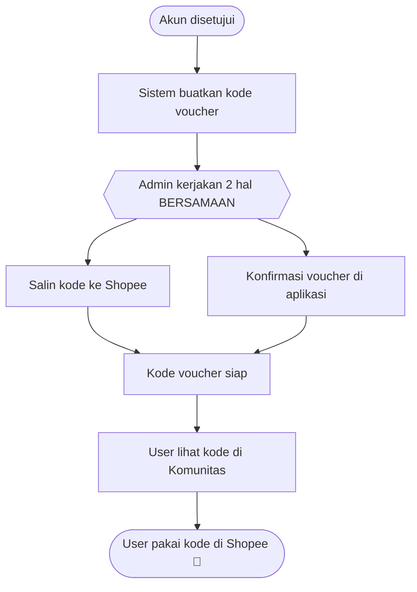
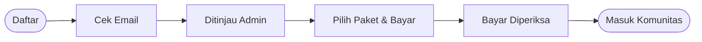
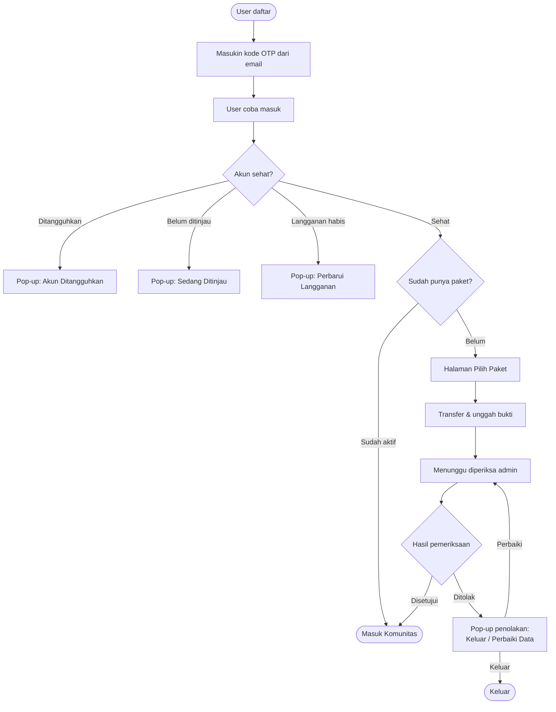

[# Perjalanan User Sarang Gasing — Panduan buat Designer

Dokumen ini nyeritain **12 kondisi user** dari awal daftar sampai masuk komunitas,
pakai bahasa sehari-hari. Fokusnya: *apa yang user lihat di layar, apa yang dia rasain,
dan layar/modal apa yang perlu kita desain.*

> Buat versi teknis (field, kode, logika sistem) lihat [USER_STATE_FLOWS.md](USER_STATE_FLOWS.md).

---

## Gambaran besar

Ada 2 aplikasi yang user lewati:

1. **Halaman Masuk & Bayar** — tempat user daftar, login, pilih paket, bayar.
2. **Komunitas** — tujuan akhir. Isinya materi, forum, tantangan. Cuma bisa diakses kalau akun beres.

User ibarat lewat beberapa "pintu pemeriksaan" sebelum sampai ke Komunitas:

Di tiap pintu, kalau ada yang belum beres, user ketemu **layar penjelasan atau pop-up (modal)**.
Nah, layar-layar inilah yang perlu kita desain dengan jelas dan nggak bikin panik.

---

## 12 Kondisi User

Tiap kondisi kami tulis: **Situasi → Yang user lihat → Yang perlu didesain.**

### 1. Baru daftar, email belum dikonfirmasi
- **Situasi**: User baru isi formulir daftar.
- **Yang user lihat**: Layar minta masukin **kode OTP** yang dikirim ke email. Ada tombol "kirim ulang kode" dengan hitung mundur.
- **Perasaan user**: Nunggu, pengen cepat. Kadang bingung cari email.
- **Perlu didesain**: Layar input OTP (6 kotak), pesan "cek email kamu", timer kirim ulang, dan pesan error kalau kode salah.

### 2. Email sudah dikonfirmasi, tapi belum disetujui admin
- **Situasi**: Email beres, tapi tim Gasing belum meninjau akunnya.
- **Yang user lihat**: Pop-up **"Kami Sedang Meninjau Akunmu"** — dijanjikan maksimal 24 jam, diminta cek email berkala. User belum bisa masuk.
- **Perasaan user**: Sabar menunggu. Butuh kepastian, jangan sampai merasa "digantung".
- **Perlu didesain**: Modal tunggu yang menenangkan (ikon ramah, teks jelas soal 24 jam), 1 tombol "Oke".

### 3. Sudah disetujui, tapi belum pernah beli paket
- **Situasi**: Akun aktif, tapi belum langganan.
- **Yang user lihat**: Langsung diarahkan ke **halaman Pilih Paket**.
- **Perasaan user**: Siap mulai, lagi mempertimbangkan harga/paket.
- **Perlu didesain**: Halaman daftar paket (kartu paket, harga, tombol pilih) yang bikin gampang membandingkan.

### 4. Sudah checkout manual, belum unggah bukti bayar
- **Situasi**: User pilih bayar transfer manual, tapi belum kirim bukti.
- **Yang user lihat**: **Halaman Transfer Bank** (nomor rekening, jumlah, cara bayar). Sementara ini dia tetap boleh masuk Komunitas dulu.
- **Perasaan user**: Lagi proses bayar, mungkin pindah ke aplikasi bank dulu.
- **Perlu didesain**: Halaman instruksi transfer yang jelas (nominal gampang disalin, tombol unggah bukti menonjol).

### 5. Bukti bayar sudah diunggah, menunggu diperiksa admin
- **Situasi**: Bukti masuk, admin belum memeriksa.
- **Yang user lihat**: Status **"Menunggu Verifikasi Pembayaran"**. User tetap boleh masuk sambil menunggu.
- **Perasaan user**: Berharap cepat disetujui. Butuh rasa aman bahwa buktinya sudah diterima.
- **Perlu didesain**: Penanda status "sedang diperiksa" (badge/label), dan konfirmasi "bukti kamu sudah kami terima".

### 6. Pembayaran ditolak
- **Situasi**: Admin menolak pembayaran (bukti nggak sesuai, dll).
- **Yang user lihat**: Saat coba masuk, muncul **pop-up penolakan** berisi *alasan* + dua tombol: **"Keluar"** dan **"Perbaiki Data"**. Kalau pilih perbaiki, dia bisa mengirim ulang dan kembali ke status "sedang diperiksa" (kesempatan kedua).
- **Perasaan user**: Kecewa / bingung kenapa ditolak. Rentan frustrasi.
- **Perlu didesain**: Modal penolakan yang **jelas alasannya tapi tetap sopan**, jalan keluar yang gampang (perbaiki data), bukan jalan buntu.

### 7. Langganan aktif (pembayaran disetujui) 🎉
- **Situasi**: Semua beres, bayar diterima.
- **Yang user lihat**: Langsung masuk **Komunitas** dengan akses penuh.
- **Perasaan user**: Senang, siap pakai.
- **Perlu didesain**: (Opsional) momen "selamat datang" / onboarding singkat di Komunitas.

### 8. Langganan habis / dibatalkan
- **Situasi**: Masa langganan berakhir.
- **Yang user lihat**: Pop-up **"Masa Berlangganan Berakhir"** dengan dua tombol: **"Keluar"** dan **"Perbarui Langganan"**.
- **Perasaan user**: Nggak mau kehilangan akses. Ini momen penting buat ngajak perpanjang.
- **Perlu didesain**: Modal ajakan perpanjang yang positif (bukan menakut-nakuti), tombol "Perbarui" menonjol.

### 9. Akun ditangguhkan (suspend)
- **Situasi**: Admin menangguhkan akun karena melanggar aturan.
- **Yang user lihat**: Pop-up **"Akun Kamu Ditangguhkan"** berisi *alasan*, *berapa lama*, *sampai kapan*, plus tautan panduan komunitas. Tombol: "Hubungi Kami" & "Saya Mengerti".
- **Perasaan user**: Bisa marah/defensif. Perlu nada tegas tapi tetap manusiawi.
- **Perlu didesain**: Modal serius (warna merah lembut, ikon perisai), info durasi jelas, jalur "hubungi kami" biar user nggak merasa dibuang.

### 10. Dijadwalkan dihapus
- **Situasi**: Akun masuk antrean penghapusan (biasanya setelah ditolak & tak diperbaiki).
- **Yang user lihat**: *(Saat ini belum ada layar khusus buat user — baru terlihat di sisi admin.)*
- **Perasaan user**: —
- **Perlu didesain**: ⚠ **Peluang desain baru** — mungkin perlu layar/pesan "akunmu akan dihapus pada tanggal X, ini cara membatalkannya". Belum ada, worth diskusi.

### 11. Akun dinonaktifkan admin (disabled)
- **Situasi**: Akun dimatikan aksesnya oleh admin.
- **Yang user lihat**: Alurnya diarahkan ke tempat berbeda (bukan Komunitas biasa). Belum ada pesan khusus yang menjelaskan ke user.
- **Perasaan user**: Bingung kenapa aksesnya beda.
- **Perlu didesain**: ⚠ **Peluang desain baru** — pesan yang menjelaskan status akun dinonaktifkan + apa yang harus dilakukan.

### 12. User mendapatkan voucher (dipakai di Shopee)
- **Situasi**: Saat menyetujui akun, sistem membuat **kode voucher** untuk user. Voucher ini **dipakai di Shopee**, bukan di aplikasi kita.
- **Alur di balik layar**: Setelah sistem membuat kode, **admin menyalin kode itu ke Shopee** (bikin voucher Shopee dengan kode yang sama). Tujuannya biar kode yang user lihat di Komunitas benar-benar bisa langsung dipakai di Shopee.
- **Yang user lihat**: Kode voucher tampil **di dalam Komunitas**. User menyalin kode itu, lalu memakainya **di Shopee** untuk dapat potongan.
- **Perasaan user**: Senang dapat potongan. Tapi bisa bingung kalau nggak jelas "kode ini dipakai di mana".
- **Perlu didesain**:
  - **Di Komunitas**: tampilan kode voucher yang **gampang disalin** (tombol "Salin kode") + **petunjuk singkat** "pakai kode ini di Shopee".
  - **Di sisi admin**: pengingat/langkah jelas "salin kode ini ke Shopee" biar admin nggak lupa dan nggak salah ketik.

**Alur singkat voucher:**

---

## Peta perjalanan lengkap (versi sederhana)

---

## Ringkasan cepat: kondisi → yang perlu didesain

| Kondisi | Yang user lihat | Prioritas desain |
|---------|-----------------|------------------|
| 1. Baru daftar | Layar kode OTP | Input OTP + timer |
| 2. Belum ditinjau | Pop-up "sedang ditinjau" | Modal tunggu menenangkan |
| 3. Belum beli paket | Halaman pilih paket | Kartu paket jelas |
| 4. Belum unggah bukti | Halaman transfer bank | Instruksi transfer + tombol unggah |
| 5. Menunggu diperiksa | Label "sedang diperiksa" | Penanda status |
| 6. Bayar ditolak | Pop-up penolakan + alasan | Modal sopan + jalan keluar |
| 7. Langganan aktif | Masuk Komunitas | (Opsional) sambutan |
| 8. Langganan habis | Pop-up perbarui | Ajakan perpanjang positif |
| 9. Ditangguhkan | Pop-up suspend | Modal serius tapi manusiawi |
| 10. Dijadwalkan hapus | *(belum ada)* | ⚠ Perlu layar baru |
| 11. Dinonaktifkan | *(belum ada pesan)* | ⚠ Perlu pesan baru |
| 12. Dapat voucher | Kode voucher di Komunitas (dipakai di Shopee) | Kode gampang disalin + petunjuk "pakai di Shopee" |

---

## Catatan buat diskusi tim

- **Kondisi 10 & 11 belum punya tampilan buat user.** Ini peluang desain: user yang akunnya mau dihapus / dinonaktifkan sebaiknya dikasih penjelasan, bukan dibiarkan bingung.
- **Nada pesan (tone) itu penting.** Modal penolakan (6) dan penangguhan (9) adalah momen sensitif — desain & copy harus tegas tapi tidak bikin user merasa dihakimi.
- **Kondisi 4 & 5 mirip** dari sisi user (dua-duanya "sedang menunggu"). Yang membedakan cuma sudah/belum unggah bukti — pastikan penanda statusnya beda biar user paham posisinya.
- **Voucher (12) dipakai di Shopee, bukan di app kita.** Ini gampang bikin user bingung. Desain kode voucher di Komunitas harus jelas: tombol salin + kalimat "pakai kode ini di Shopee". Penyalinan kode ke Shopee sekarang masih **manual oleh admin** (rawan salah ketik) — worth diomongin sama tim apakah perlu bantuan di UI admin biar nggak keliru.
</content>
# Perjalanan User Sarang Gasing — Panduan buat Designer

Dokumen ini nyeritain **12 kondisi user** dari awal daftar sampai masuk komunitas,
pakai bahasa sehari-hari. Fokusnya: *apa yang user lihat di layar, apa yang dia rasain,
dan layar/modal apa yang perlu kita desain.*

> Buat versi teknis (field, kode, logika sistem) lihat [USER_STATE_FLOWS.md](USER_STATE_FLOWS.md).

---

## Gambaran besar

Ada 2 aplikasi yang user lewati:

1. **Halaman Masuk & Bayar** — tempat user daftar, login, pilih paket, bayar.
2. **Komunitas** — tujuan akhir. Isinya materi, forum, tantangan. Cuma bisa diakses kalau akun beres.

User ibarat lewat beberapa "pintu pemeriksaan" sebelum sampai ke Komunitas:

Di tiap pintu, kalau ada yang belum beres, user ketemu **layar penjelasan atau pop-up (modal)**.
Nah, layar-layar inilah yang perlu kita desain dengan jelas dan nggak bikin panik.

---

## 12 Kondisi User

Tiap kondisi kami tulis: **Situasi → Yang user lihat → Yang perlu didesain.**

### 1. Baru daftar, email belum dikonfirmasi
- **Situasi**: User baru isi formulir daftar.
- **Yang user lihat**: Layar minta masukin **kode OTP** yang dikirim ke email. Ada tombol "kirim ulang kode" dengan hitung mundur.
- **Perasaan user**: Nunggu, pengen cepat. Kadang bingung cari email.
- **Perlu didesain**: Layar input OTP (6 kotak), pesan "cek email kamu", timer kirim ulang, dan pesan error kalau kode salah.

### 2. Email sudah dikonfirmasi, tapi belum disetujui admin
- **Situasi**: Email beres, tapi tim Gasing belum meninjau akunnya.
- **Yang user lihat**: Pop-up **"Kami Sedang Meninjau Akunmu"** — dijanjikan maksimal 24 jam, diminta cek email berkala. User belum bisa masuk.
- **Perasaan user**: Sabar menunggu. Butuh kepastian, jangan sampai merasa "digantung".
- **Perlu didesain**: Modal tunggu yang menenangkan (ikon ramah, teks jelas soal 24 jam), 1 tombol "Oke".

### 3. Sudah disetujui, tapi belum pernah beli paket
- **Situasi**: Akun aktif, tapi belum langganan.
- **Yang user lihat**: Langsung diarahkan ke **halaman Pilih Paket**.
- **Perasaan user**: Siap mulai, lagi mempertimbangkan harga/paket.
- **Perlu didesain**: Halaman daftar paket (kartu paket, harga, tombol pilih) yang bikin gampang membandingkan.

### 4. Sudah checkout manual, belum unggah bukti bayar
- **Situasi**: User pilih bayar transfer manual, tapi belum kirim bukti.
- **Yang user lihat**: **Halaman Transfer Bank** (nomor rekening, jumlah, cara bayar). Sementara ini dia tetap boleh masuk Komunitas dulu.
- **Perasaan user**: Lagi proses bayar, mungkin pindah ke aplikasi bank dulu.
- **Perlu didesain**: Halaman instruksi transfer yang jelas (nominal gampang disalin, tombol unggah bukti menonjol).

### 5. Bukti bayar sudah diunggah, menunggu diperiksa admin
- **Situasi**: Bukti masuk, admin belum memeriksa.
- **Yang user lihat**: Status **"Menunggu Verifikasi Pembayaran"**. User tetap boleh masuk sambil menunggu.
- **Perasaan user**: Berharap cepat disetujui. Butuh rasa aman bahwa buktinya sudah diterima.
- **Perlu didesain**: Penanda status "sedang diperiksa" (badge/label), dan konfirmasi "bukti kamu sudah kami terima".

### 6. Pembayaran ditolak
- **Situasi**: Admin menolak pembayaran (bukti nggak sesuai, dll).
- **Yang user lihat**: Saat coba masuk, muncul **pop-up penolakan** berisi *alasan* + dua tombol: **"Keluar"** dan **"Perbaiki Data"**. Kalau pilih perbaiki, dia bisa mengirim ulang dan kembali ke status "sedang diperiksa" (kesempatan kedua).
- **Perasaan user**: Kecewa / bingung kenapa ditolak. Rentan frustrasi.
- **Perlu didesain**: Modal penolakan yang **jelas alasannya tapi tetap sopan**, jalan keluar yang gampang (perbaiki data), bukan jalan buntu.

### 7. Langganan aktif (pembayaran disetujui) 🎉
- **Situasi**: Semua beres, bayar diterima.
- **Yang user lihat**: Langsung masuk **Komunitas** dengan akses penuh.
- **Perasaan user**: Senang, siap pakai.
- **Perlu didesain**: (Opsional) momen "selamat datang" / onboarding singkat di Komunitas.

### 8. Langganan habis / dibatalkan
- **Situasi**: Masa langganan berakhir.
- **Yang user lihat**: Pop-up **"Masa Berlangganan Berakhir"** dengan dua tombol: **"Keluar"** dan **"Perbarui Langganan"**.
- **Perasaan user**: Nggak mau kehilangan akses. Ini momen penting buat ngajak perpanjang.
- **Perlu didesain**: Modal ajakan perpanjang yang positif (bukan menakut-nakuti), tombol "Perbarui" menonjol.

### 9. Akun ditangguhkan (suspend)
- **Situasi**: Admin menangguhkan akun karena melanggar aturan.
- **Yang user lihat**: Pop-up **"Akun Kamu Ditangguhkan"** berisi *alasan*, *berapa lama*, *sampai kapan*, plus tautan panduan komunitas. Tombol: "Hubungi Kami" & "Saya Mengerti".
- **Perasaan user**: Bisa marah/defensif. Perlu nada tegas tapi tetap manusiawi.
- **Perlu didesain**: Modal serius (warna merah lembut, ikon perisai), info durasi jelas, jalur "hubungi kami" biar user nggak merasa dibuang.

### 10. Dijadwalkan dihapus
- **Situasi**: Akun masuk antrean penghapusan (biasanya setelah ditolak & tak diperbaiki).
- **Yang user lihat**: *(Saat ini belum ada layar khusus buat user — baru terlihat di sisi admin.)*
- **Perasaan user**: —
- **Perlu didesain**: ⚠ **Peluang desain baru** — mungkin perlu layar/pesan "akunmu akan dihapus pada tanggal X, ini cara membatalkannya". Belum ada, worth diskusi.

### 11. Akun dinonaktifkan admin (disabled)
- **Situasi**: Akun dimatikan aksesnya oleh admin.
- **Yang user lihat**: Alurnya diarahkan ke tempat berbeda (bukan Komunitas biasa). Belum ada pesan khusus yang menjelaskan ke user.
- **Perasaan user**: Bingung kenapa aksesnya beda.
- **Perlu didesain**: ⚠ **Peluang desain baru** — pesan yang menjelaskan status akun dinonaktifkan + apa yang harus dilakukan.

### 12. User mendapatkan voucher (dipakai di Shopee)
- **Situasi**: Saat menyetujui akun, sistem membuat **kode voucher** untuk user. Voucher ini **dipakai di Shopee**, bukan di aplikasi kita.
- **Alur di balik layar**: Setelah sistem membuat kode, **admin menyalin kode itu ke Shopee** (bikin voucher Shopee dengan kode yang sama). Tujuannya biar kode yang user lihat di Komunitas benar-benar bisa langsung dipakai di Shopee.
- **Yang user lihat**: Kode voucher tampil **di dalam Komunitas**. User menyalin kode itu, lalu memakainya **di Shopee** untuk dapat potongan.
- **Perasaan user**: Senang dapat potongan. Tapi bisa bingung kalau nggak jelas "kode ini dipakai di mana".
- **Perlu didesain**:
  - **Di Komunitas**: tampilan kode voucher yang **gampang disalin** (tombol "Salin kode") + **petunjuk singkat** "pakai kode ini di Shopee".
  - **Di sisi admin**: pengingat/langkah jelas "salin kode ini ke Shopee" biar admin nggak lupa dan nggak salah ketik.

---

## Peta perjalanan lengkap (versi sederhana)

---

## Ringkasan cepat: kondisi → yang perlu didesain

| Kondisi | Yang user lihat | Prioritas desain |
|---------|-----------------|------------------|
| 1. Baru daftar | Layar kode OTP | Input OTP + timer |
| 2. Belum ditinjau | Pop-up "sedang ditinjau" | Modal tunggu menenangkan |
| 3. Belum beli paket | Halaman pilih paket | Kartu paket jelas |
| 4. Belum unggah bukti | Halaman transfer bank | Instruksi transfer + tombol unggah |
| 5. Menunggu diperiksa | Label "sedang diperiksa" | Penanda status |
| 6. Bayar ditolak | Pop-up penolakan + alasan | Modal sopan + jalan keluar |
| 7. Langganan aktif | Masuk Komunitas | (Opsional) sambutan |
| 8. Langganan habis | Pop-up perbarui | Ajakan perpanjang positif |
| 9. Ditangguhkan | Pop-up suspend | Modal serius tapi manusiawi |
| 10. Dijadwalkan hapus | *(belum ada)* | ⚠ Perlu layar baru |
| 11. Dinonaktifkan | *(belum ada pesan)* | ⚠ Perlu pesan baru |
| 12. Dapat voucher | Kode voucher di Komunitas (dipakai di Shopee) | Kode gampang disalin + petunjuk "pakai di Shopee" |

---

## Catatan buat diskusi tim

- **Kondisi 10 & 11 belum punya tampilan buat user.** Ini peluang desain: user yang akunnya mau dihapus / dinonaktifkan sebaiknya dikasih penjelasan, bukan dibiarkan bingung.
- **Nada pesan (tone) itu penting.** Modal penolakan (6) dan penangguhan (9) adalah momen sensitif — desain & copy harus tegas tapi tidak bikin user merasa dihakimi.
- **Kondisi 4 & 5 mirip** dari sisi user (dua-duanya "sedang menunggu"). Yang membedakan cuma sudah/belum unggah bukti — pastikan penanda statusnya beda biar user paham posisinya.
- **Voucher (12) dipakai di Shopee, bukan di app kita.** Ini gampang bikin user bingung. Desain kode voucher di Komunitas harus jelas: tombol salin + kalimat "pakai kode ini di Shopee". Penyalinan kode ke Shopee sekarang masih **manual oleh admin** (rawan salah ketik) — worth diomongin sama tim apakah perlu bantuan di UI admin biar nggak keliru.
</content>
# Perjalanan User Sarang Gasing — Panduan buat Designer

Dokumen ini nyeritain **12 kondisi user** dari awal daftar sampai masuk komunitas,
pakai bahasa sehari-hari. Fokusnya: *apa yang user lihat di layar, apa yang dia rasain,
dan layar/modal apa yang perlu kita desain.*

> Buat versi teknis (field, kode, logika sistem) lihat [USER_STATE_FLOWS.md](USER_STATE_FLOWS.md).

---

## Gambaran besar

Ada 2 aplikasi yang user lewati:

1. **Halaman Masuk & Bayar** — tempat user daftar, login, pilih paket, bayar.
2. **Komunitas** — tujuan akhir. Isinya materi, forum, tantangan. Cuma bisa diakses kalau akun beres.

User ibarat lewat beberapa "pintu pemeriksaan" sebelum sampai ke Komunitas:

Di tiap pintu, kalau ada yang belum beres, user ketemu **layar penjelasan atau pop-up (modal)**.
Nah, layar-layar inilah yang perlu kita desain dengan jelas dan nggak bikin panik.

---

## 12 Kondisi User

Tiap kondisi kami tulis: **Situasi → Yang user lihat → Yang perlu didesain.**

### 1. Baru daftar, email belum dikonfirmasi
- **Situasi**: User baru isi formulir daftar.
- **Yang user lihat**: Layar minta masukin **kode OTP** yang dikirim ke email. Ada tombol "kirim ulang kode" dengan hitung mundur.
- **Perasaan user**: Nunggu, pengen cepat. Kadang bingung cari email.
- **Perlu didesain**: Layar input OTP (6 kotak), pesan "cek email kamu", timer kirim ulang, dan pesan error kalau kode salah.

### 2. Email sudah dikonfirmasi, tapi belum disetujui admin
- **Situasi**: Email beres, tapi tim Gasing belum meninjau akunnya.
- **Yang user lihat**: Pop-up **"Kami Sedang Meninjau Akunmu"** — dijanjikan maksimal 24 jam, diminta cek email berkala. User belum bisa masuk.
- **Perasaan user**: Sabar menunggu. Butuh kepastian, jangan sampai merasa "digantung".
- **Perlu didesain**: Modal tunggu yang menenangkan (ikon ramah, teks jelas soal 24 jam), 1 tombol "Oke".

### 3. Sudah disetujui, tapi belum pernah beli paket
- **Situasi**: Akun aktif, tapi belum langganan.
- **Yang user lihat**: Langsung diarahkan ke **halaman Pilih Paket**.
- **Perasaan user**: Siap mulai, lagi mempertimbangkan harga/paket.
- **Perlu didesain**: Halaman daftar paket (kartu paket, harga, tombol pilih) yang bikin gampang membandingkan.

### 4. Sudah checkout manual, belum unggah bukti bayar
- **Situasi**: User pilih bayar transfer manual, tapi belum kirim bukti.
- **Yang user lihat**: **Halaman Transfer Bank** (nomor rekening, jumlah, cara bayar). Sementara ini dia tetap boleh masuk Komunitas dulu.
- **Perasaan user**: Lagi proses bayar, mungkin pindah ke aplikasi bank dulu.
- **Perlu didesain**: Halaman instruksi transfer yang jelas (nominal gampang disalin, tombol unggah bukti menonjol).

### 5. Bukti bayar sudah diunggah, menunggu diperiksa admin
- **Situasi**: Bukti masuk, admin belum memeriksa.
- **Yang user lihat**: Status **"Menunggu Verifikasi Pembayaran"**. User tetap boleh masuk sambil menunggu.
- **Perasaan user**: Berharap cepat disetujui. Butuh rasa aman bahwa buktinya sudah diterima.
- **Perlu didesain**: Penanda status "sedang diperiksa" (badge/label), dan konfirmasi "bukti kamu sudah kami terima".

### 6. Pembayaran ditolak
- **Situasi**: Admin menolak pembayaran (bukti nggak sesuai, dll).
- **Yang user lihat**: Saat coba masuk, muncul **pop-up penolakan** berisi *alasan* + dua tombol: **"Keluar"** dan **"Perbaiki Data"**. Kalau pilih perbaiki, dia bisa mengirim ulang dan kembali ke status "sedang diperiksa" (kesempatan kedua).
- **Perasaan user**: Kecewa / bingung kenapa ditolak. Rentan frustrasi.
- **Perlu didesain**: Modal penolakan yang **jelas alasannya tapi tetap sopan**, jalan keluar yang gampang (perbaiki data), bukan jalan buntu.

### 7. Langganan aktif (pembayaran disetujui) 🎉
- **Situasi**: Semua beres, bayar diterima.
- **Yang user lihat**: Langsung masuk **Komunitas** dengan akses penuh.
- **Perasaan user**: Senang, siap pakai.
- **Perlu didesain**: (Opsional) momen "selamat datang" / onboarding singkat di Komunitas.

### 8. Langganan habis / dibatalkan
- **Situasi**: Masa langganan berakhir.
- **Yang user lihat**: Pop-up **"Masa Berlangganan Berakhir"** dengan dua tombol: **"Keluar"** dan **"Perbarui Langganan"**.
- **Perasaan user**: Nggak mau kehilangan akses. Ini momen penting buat ngajak perpanjang.
- **Perlu didesain**: Modal ajakan perpanjang yang positif (bukan menakut-nakuti), tombol "Perbarui" menonjol.

### 9. Akun ditangguhkan (suspend)
- **Situasi**: Admin menangguhkan akun karena melanggar aturan.
- **Yang user lihat**: Pop-up **"Akun Kamu Ditangguhkan"** berisi *alasan*, *berapa lama*, *sampai kapan*, plus tautan panduan komunitas. Tombol: "Hubungi Kami" & "Saya Mengerti".
- **Perasaan user**: Bisa marah/defensif. Perlu nada tegas tapi tetap manusiawi.
- **Perlu didesain**: Modal serius (warna merah lembut, ikon perisai), info durasi jelas, jalur "hubungi kami" biar user nggak merasa dibuang.

### 10. Dijadwalkan dihapus
- **Situasi**: Akun masuk antrean penghapusan (biasanya setelah ditolak & tak diperbaiki).
- **Yang user lihat**: *(Saat ini belum ada layar khusus buat user — baru terlihat di sisi admin.)*
- **Perasaan user**: —
- **Perlu didesain**: ⚠ **Peluang desain baru** — mungkin perlu layar/pesan "akunmu akan dihapus pada tanggal X, ini cara membatalkannya". Belum ada, worth diskusi.

### 11. Akun dinonaktifkan admin (disabled)
- **Situasi**: Akun dimatikan aksesnya oleh admin.
- **Yang user lihat**: Alurnya diarahkan ke tempat berbeda (bukan Komunitas biasa). Belum ada pesan khusus yang menjelaskan ke user.
- **Perasaan user**: Bingung kenapa aksesnya beda.
- **Perlu didesain**: ⚠ **Peluang desain baru** — pesan yang menjelaskan status akun dinonaktifkan + apa yang harus dilakukan.

### 12. User mendapatkan voucher
- **Situasi**: Saat menyetujui akun, admin memberi **kode voucher** (potongan harga) ke user.
- **Yang user lihat**: Kode voucher yang bisa dipakai **saat memilih paket/bayar** untuk memotong harga.
- **Perasaan user**: Senang dapat potongan — pemicu untuk segera berlangganan.
- **Perlu didesain**: Tempat memasukkan/menampilkan kode voucher di halaman bayar, dan tampilan "potongan berhasil dipakai".

---

## Peta perjalanan lengkap (versi sederhana)

---

## Ringkasan cepat: kondisi → yang perlu didesain

| Kondisi | Yang user lihat | Prioritas desain |
|---------|-----------------|------------------|
| 1. Baru daftar | Layar kode OTP | Input OTP + timer |
| 2. Belum ditinjau | Pop-up "sedang ditinjau" | Modal tunggu menenangkan |
| 3. Belum beli paket | Halaman pilih paket | Kartu paket jelas |
| 4. Belum unggah bukti | Halaman transfer bank | Instruksi transfer + tombol unggah |
| 5. Menunggu diperiksa | Label "sedang diperiksa" | Penanda status |
| 6. Bayar ditolak | Pop-up penolakan + alasan | Modal sopan + jalan keluar |
| 7. Langganan aktif | Masuk Komunitas | (Opsional) sambutan |
| 8. Langganan habis | Pop-up perbarui | Ajakan perpanjang positif |
| 9. Ditangguhkan | Pop-up suspend | Modal serius tapi manusiawi |
| 10. Dijadwalkan hapus | *(belum ada)* | ⚠ Perlu layar baru |
| 11. Dinonaktifkan | *(belum ada pesan)* | ⚠ Perlu pesan baru |
| 12. Dapat voucher | Kode potongan harga | Input voucher di halaman bayar |

---

## Catatan buat diskusi tim

- **Kondisi 10 & 11 belum punya tampilan buat user.** Ini peluang desain: user yang akunnya mau dihapus / dinonaktifkan sebaiknya dikasih penjelasan, bukan dibiarkan bingung.
- **Nada pesan (tone) itu penting.** Modal penolakan (6) dan penangguhan (9) adalah momen sensitif — desain & copy harus tegas tapi tidak bikin user merasa dihakimi.
- **Kondisi 4 & 5 mirip** dari sisi user (dua-duanya "sedang menunggu"). Yang membedakan cuma sudah/belum unggah bukti — pastikan penanda statusnya beda biar user paham posisinya.
</content>
](https://github.com/Digital-Gasing-Edukasi/Gasing-Sarang-Login-Dashboard/blob/main/USER_FLOW.md)
