# Alur State User — Sarang Gasing (Login-Dashboard → Komonitas)

Dokumen ini petain **11 state user** dari daftar sampe masuk komunitas.
Tiap state ada flowchart sendiri + 1 flowchart gabungan di akhir.

- **Audience**: dev FE/BE + QA.
- **Sumber**: source code `Login-Dashboard/src` + `Komonitas`, docs internal, flowchart signup.
- **Legend**: ✅ lolos | 🚫 blok/modal | ⚠ gap (belum di-handle di code).

---

## Arsitektur singkat

| app | stack | tugas |
|-----|-------|-------|
| **Login-Dashboard** (`app0`) | React + Vite | daftar, login, bayar, admin dashboard, gate status |
| **Komonitas** (`app1`) | Next.js | konsumsi Discourse API, isi komunitas. Ga auth sendiri — terima JWT callback dari app0 |

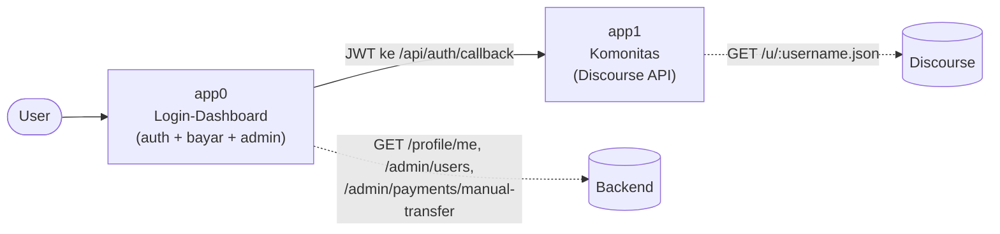

**Enum `verifiedStatus`** (`mappers.js:258`):
`REJECTED=-1 | WAITING=0 | APPROVED=1 | REVISE=2 | PENDING_VOUCHER=3`

**Gate login** (`loginGate.js`) prioritas: `suspended > pending > expired`.

---

## 1. Baru daftar, email belum dikonfirmasi

Daftar lolos → lempar ke OTP. Belum ada sesi, belum bisa login.

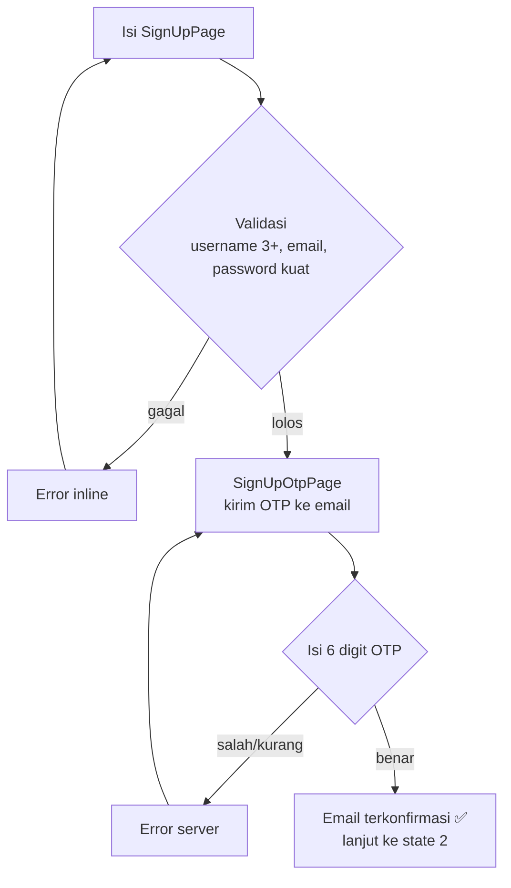

**File**: `SignUpPage.jsx`, `SignUpOtpPage.jsx`, `authApi.confirmEmail`.

---

## 2. Email dikonfirmasi, belum diverifikasi admin

`verifiedStatus = WAITING(0)`. Login diblok modal "sedang ditinjau (max 24 jam)".

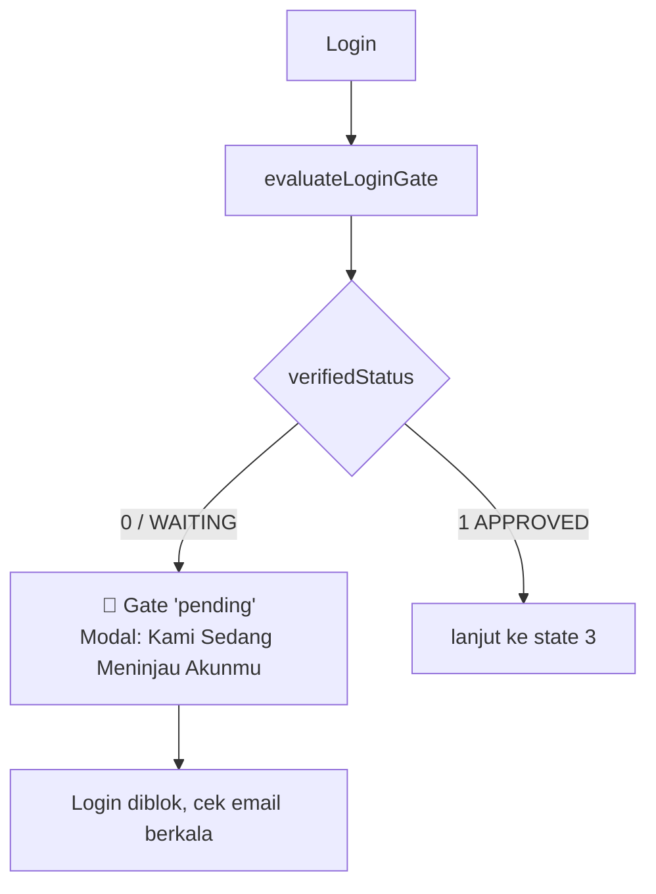

**File**: `loginGate.js:31`, `LoginStatusModal.jsx:77` (CONFIG.pending).
Admin: masih di alur **Verifikasi Akun**, belum masuk Manajemen Akun (`mappers.js:264`).

---

## 3. Terverifikasi admin, belum pernah beli paket

`APPROVED(1)` → gate lolos. Ga ada subscription → diarahin ke halaman langganan.

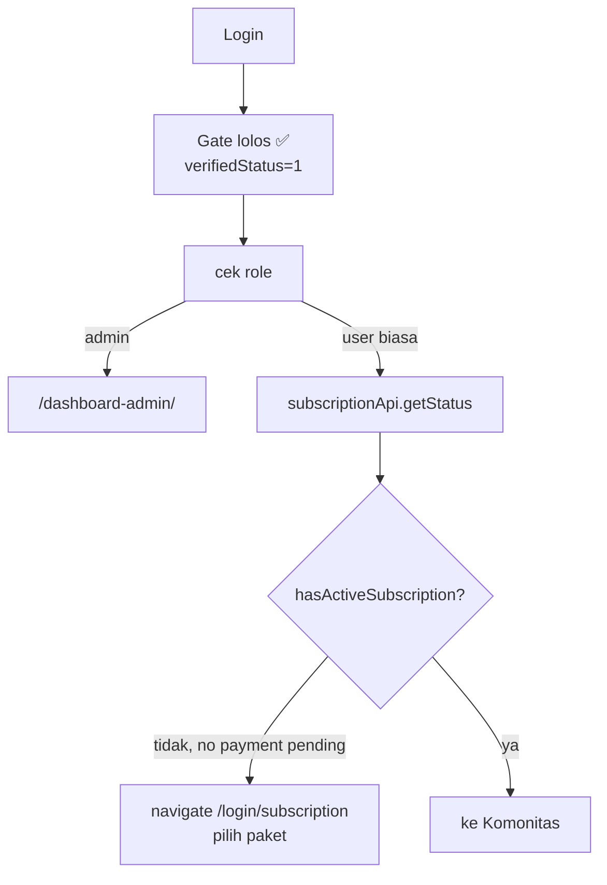

**File**: `App.jsx:388-404`, `loginGate.js:36-40` (belum pernah sub → lolos).

---

## 4. Checkout manual, belum upload bukti bayar (trial 24 jam aktif)

Payment `status=pending` → `paymentPending=true` → tetap dilolosin ke Komonitas. Halaman Transfer Bank kebuka.

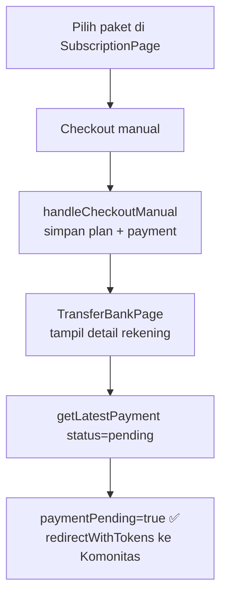

**File**: `App.jsx:336-343` (paymentPending), `App.jsx:428-432` (checkout).
⚠ "trial 24 jam" = anotasi flowchart-mu. Di code cuma logika `paymentPending`, ga ada timer trial eksplisit.

---

## 5. Bukti bayar diupload, menunggu verifikasi admin

Payment masih `pending`, bukti sudah masuk (`receipt_uploaded`). User tetap boleh masuk. Admin verifikasi manual.

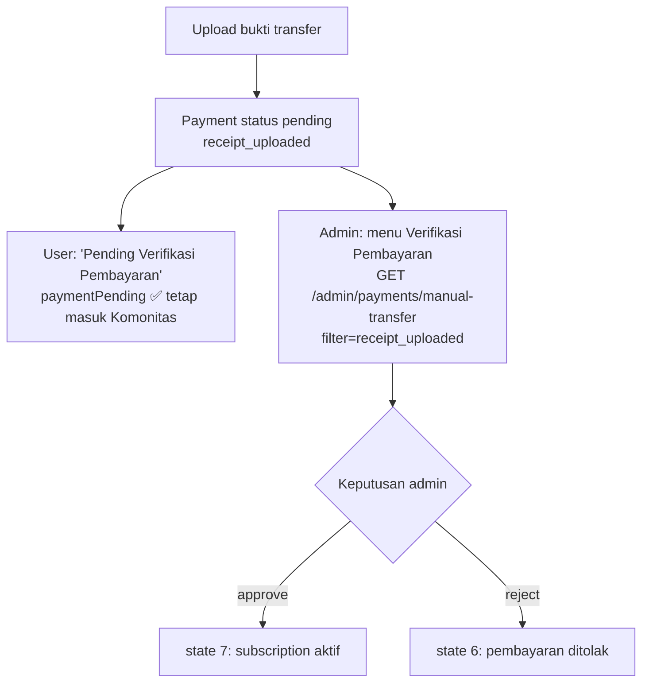

**File**: `mappers.js:348-355` (mapToPembayaran), `VerifikasiPembayaran`, memory verifikasi-pembayaran.

---

## 6. Pembayaran ditolak (belum pernah sub → dijadwalkan hapus)

Sesuai flowchart signup — alur **double-approval**. Reject-1 → perbaiki data → approval-2.

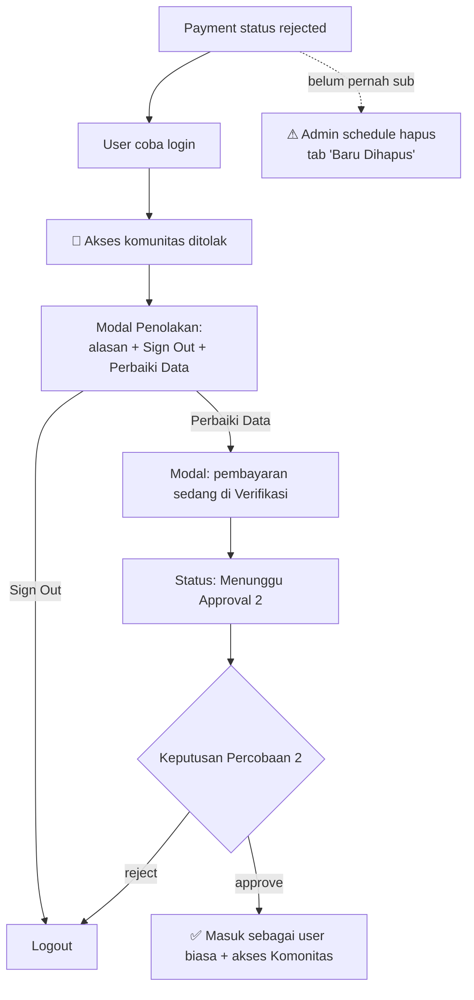

**File**: `mappers.js:352-355` (isRejected), `mappers.js:246` (deletionPending → Baru Dihapus).
`REVISE(2)` & `REJECTED(-1)` dua-duanya masuk tab admin **"Ditolak"** (`mappers.js:251`).

---

## 7. Subscription aktif (pembayaran disetujui)

`hasActiveSubscription=true` → langsung ke Komonitas, full akses.

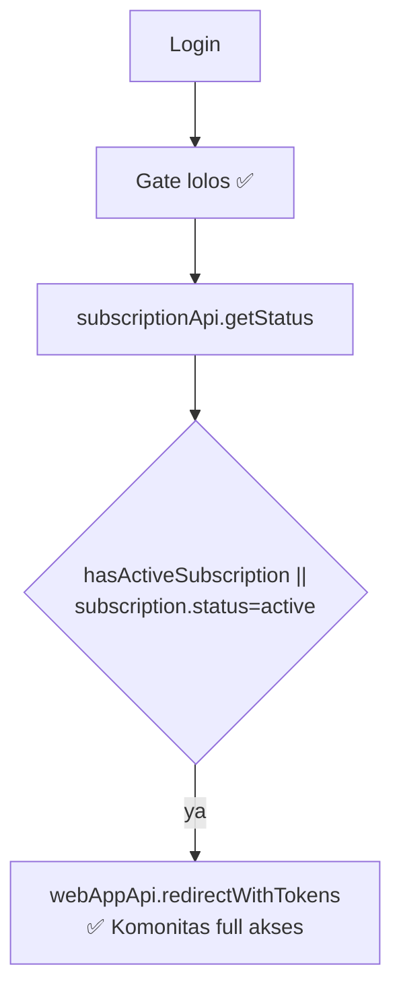

**File**: `App.jsx:390-396`.

---

## 8. Subscription expired / cancelled

`subscription.status='expired'` → gate `expired` → modal perbarui langganan. Kecuali ada payment pending.

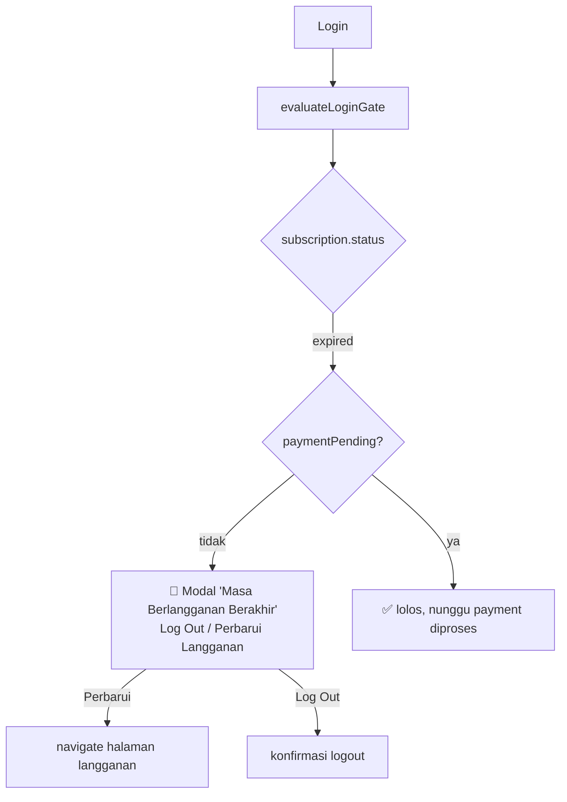

**File**: `loginGate.js:36-40`, `App.jsx:348`, `LoginStatusModal.jsx:91` (CONFIG.expired).

---

## 9. Suspended

`suspendedUntil` keisi → gate `suspended` (prioritas TERTINGGI). Login blok.

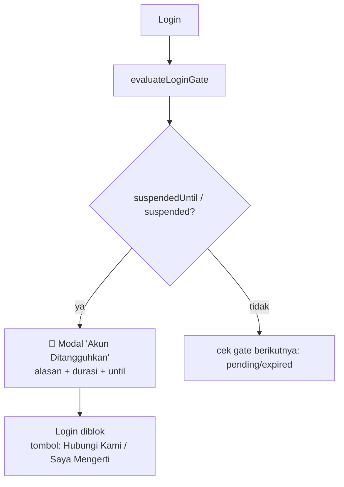

**File**: `loginGate.js:16-23`, `LoginStatusModal.jsx:124` (SuspendedModal).
Admin: tab **"Ditangguhkan"**, endpoint `/suspend` (`mappers.js:247`, `SuspendModal.jsx`).

---

## 10. Dijadwalkan hapus (pending deletion)

`deletionPending` / `deletionScheduledAt` / `deletedAt` → admin tab "Baru Dihapus".

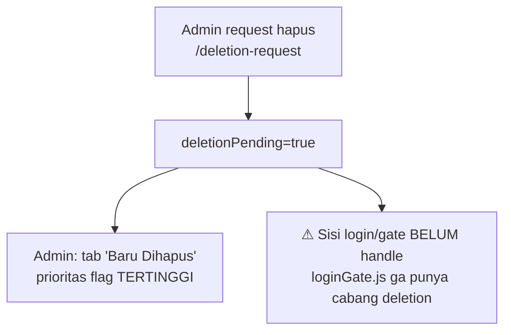

**File**: `mappers.js:246` (prioritas: penghapusan > penangguhan > verifikasi).
⚠ **Gap**: `evaluateLoginGate` belum blok state ini. Kalau perlu blok login eksplisit → TODO.

---

## 11. Disabled (dinonaktifkan admin)

Tag `USER/DISCOURSE/DISABLED-SSO` → jangan lewat SSO. Routing beda, bukan blok penuh.

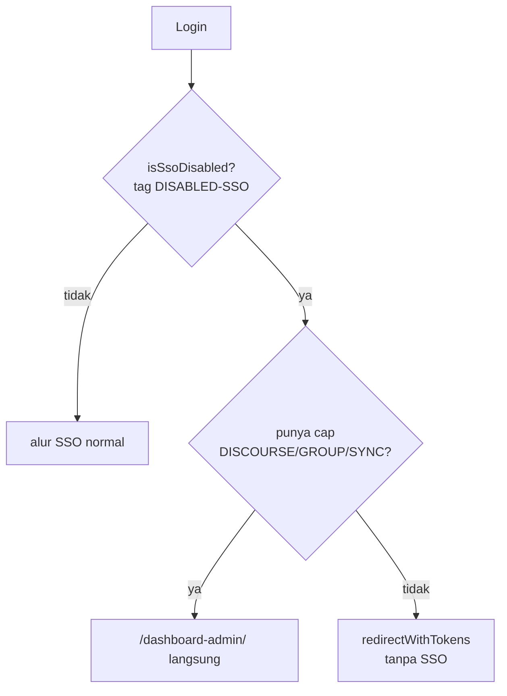

**File**: `App.jsx:356-367`.
⚠ "disabled" di sini = **routing SSO**, BUKAN blok login penuh. Nama field beda dari "disabled akun".

---

## 12. User mendapatkan voucher (alur verifikasi 2-langkah)

Voucher dikasih admin **saat approve akun**, bukan flow terpisah. `verifiedStatus`
lewat state antara `PENDING_VOUCHER(3)` — duduk di antara state 2 (WAITING) dan
state 3 (APPROVED).

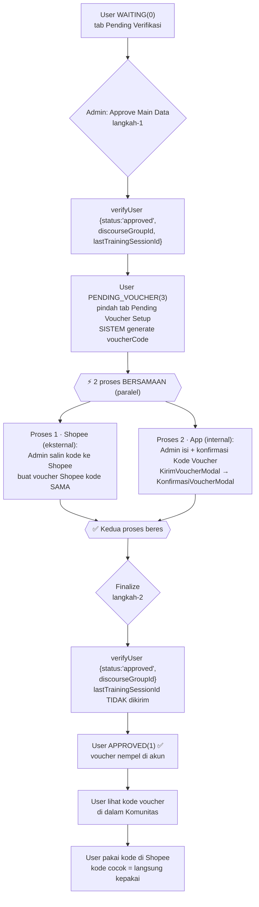

**Kenapa 2 call terpisah** (`AdminDashboardPage.jsx:738-785`, memory `verifikasi-akun-voucher-flow`):
- **Langkah-1**: kehadiran `lastTrainingSessionId` = penanda "approve main data" → backend pindah ke `PENDING_VOUCHER(3)`, BUKAN langsung approved.
- **Langkah-2**: kirim `{ status, discourseGroupId }` **tanpa** `lastTrainingSessionId` → baru mendarat di `APPROVED(1)`. Kalau ikut kirim `lastTrainingSessionId`, akun mental balik ke `PENDING_VOUCHER`.

**Langkah manual ke Shopee** (di antara langkah-1 & finalize):
- Pas sistem **pertama kali** generate `voucherCode` (saat user masuk `PENDING_VOUCHER`), admin **wajib salin kode itu ke platform Shopee** — bikin voucher Shopee dengan **kode yang sama persis**.
- Tujuan: kode yang nanti user lihat di dalam **Komunitas** bisa **langsung dipakai di Shopee** (kode match). Redeem terjadi di **Shopee**, bukan di halaman langganan app ini.

**File**: `KirimVoucherModal.jsx`, `VoucherModals.jsx`, `PendingVoucherTable.jsx`, `adminApi.verifyUser`.
⚠ `genVoucherCode()` masih placeholder FE (`AdminDashboardPage.jsx:181`) — TODO(be): kode asli mestinya dari backend.
⚠ Sinkronisasi Shopee **manual** — risiko typo/mismatch (kode di app ≠ kode di Shopee). Belum ada integrasi otomatis. Pertimbangkan validasi/konfirmasi biar admin ga salah salin.

**Sisi user**: kode voucher tampil **di dalam Komunitas**, dipakai user **di Shopee** untuk potongan. Kolom `Kode Voucher` juga muncul di tabel Manajemen Akun (sisi admin).

---

## Flowchart Keseluruhan

Gabungan 11 state — dari daftar sampe Komonitas.

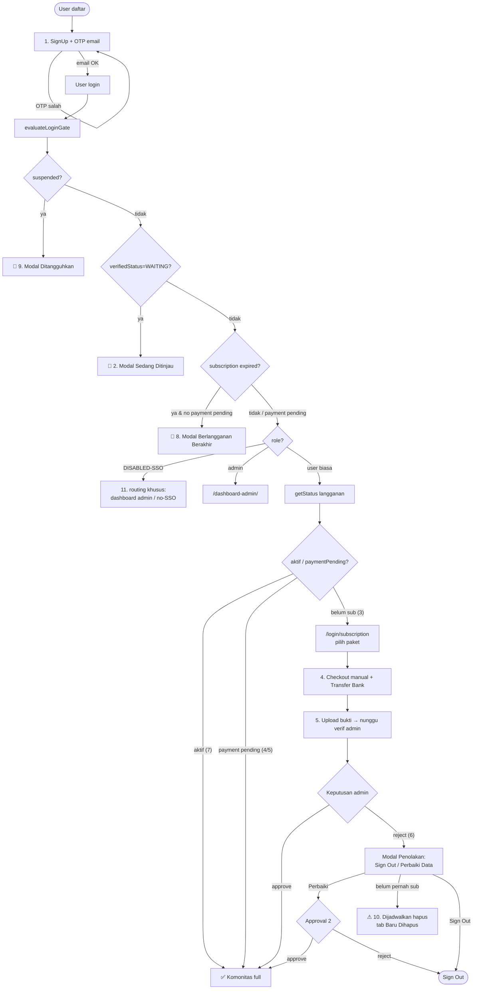

---

## Ringkasan mapping state → trigger → hasil

| # | State | Trigger / field | Hasil login |
|---|-------|-----------------|-------------|
| 1 | Baru daftar | belum konfirmasi OTP | belum ada sesi → OTP dulu |
| 2 | Belum verif admin | `verifiedStatus=0` | 🚫 modal pending |
| 3 | Verif, blm beli | `verifiedStatus=1`, no sub | ✅ → halaman langganan |
| 4 | Checkout, blm upload | payment `pending` | ✅ Komonitas (paymentPending) |
| 5 | Bukti upload | `receipt_uploaded` | ✅ Komonitas + admin verif |
| 6 | Bayar ditolak | payment `rejected` | 🚫 modal penolakan → perbaiki/approval-2 |
| 7 | Sub aktif | `hasActiveSubscription` | ✅ Komonitas full |
| 8 | Sub expired | `subscription.status=expired` | 🚫 modal perbarui |
| 9 | Suspended | `suspendedUntil` | 🚫 modal ditangguhkan |
| 10 | Pending deletion | `deletionPending` | ⚠ hanya view admin, login belum blok |
| 11 | Disabled | tag `DISABLED-SSO` | routing khusus, bukan blok |
| 12 | Dapat voucher | `PENDING_VOUCHER=3` (antara 2→3) | admin approve 2-langkah → voucher nempel |

---

## Catatan gap (buat BE/QA)

1. **State 10 & 11 belum di-gate di login** — `loginGate.js` cuma handle `suspended/pending/expired`. Pending-deletion & disabled cuma kuat di sisi admin/routing.
2. **Field masih `TODO(verify)`** — `verifiedStatus`, `suspendedUntil`, `deletionPending` nunggu bentuk asli `GET /profile/me` & `/admin/users` (lihat memory `manajemen-akun-data-gaps`).
3. **Trial 24 jam** (state 4) belum ada logika timer eksplisit — sekarang cuma `paymentPending` yg nglolosin.
4. **State 4 vs 5** identik dari sisi user (dua-duanya `paymentPending`); pembeda cuma filter admin `receipt_uploaded`.
</content>
</invoke>
