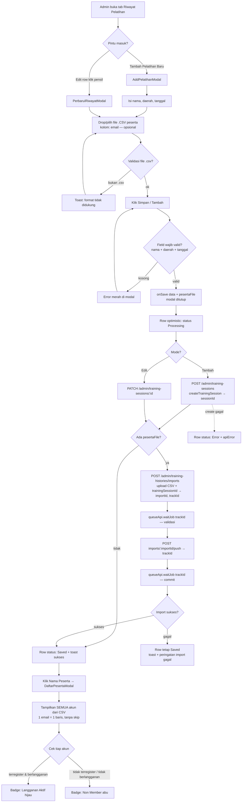

Bahan Diskusi 28 Juli 2026 :
Riwayat Pelatihan, menambahkan peserta pelatihan:

1. langganan aktif = ter-regeister dan sudah berlangganan.
2. langganan non member = tidak terregister / tidak berlangganan sama sekali.
lihat peserta : semua akun yang dimasukan dalam bentuk csv di masukan.
FLOW : Add user -> register ke riwayat pelatihan -> masukin semua data user.

Konfirmasi pembayaran : dapet apa yang di upload mas risky saat di dashboard, udah ada blm (nama pengirim, nama bank, tanggal transfer) ? 

Mention Email Notifikasi Lagi Ke Mas risky.
Max MB buat Gambar yang di upload berapa mb?
Change Email Lewat Admin gak bisa di rubah, harus lewat Email Verifikasi (ini cuman ada di dev)

toast pada copy nomor rekening saat di page transfer.

Dashboard
Riwayat pelatihan
-nama pelatihan, daerah pelatihan & email harusnya panjang boxnya (width di lebarin di Riwayat pelatihan) (Desain Udah ada)

verifikasi pembayaran
-di menunggu verifikasi -> tambahin timer & submitted (last verified apus) last verified => di kolom verifikasi akun pending voucher, jadi Last Update.
-tambahin 1 filter/tabel (Desain Udah Ada) (done)
tambah table (Sub Menu) di verifikasi pembayaran (done)

manajemen akun
-button hapus akun harusnya lebar
-di laman upload bukti pembayaran, tambahin max mb buat image bukti pembayaran
-blm ada toast di upload bukti pembayaran -> upload Berhasil, upload image di hapus.

Table : 
scrool nya di luar semua (kaya browser) -> Tambah Reference di desain. (DUMMY )