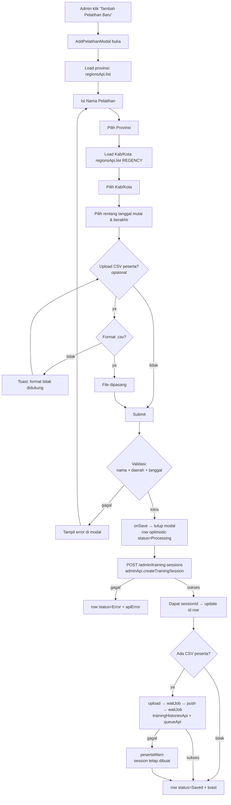
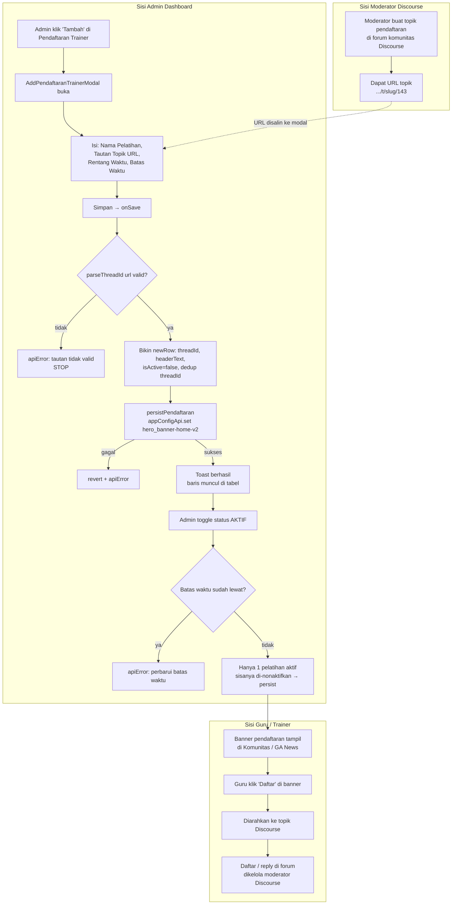

# Flow: Riwayat Pelatihan & Pendaftaran Trainer (Admin Dashboard)

Dua alur admin di `AdminDashboardPage.jsx`. Sumber kode di catatan tiap langkah.

---

## Flow 1 — Tambah Riwayat Pelatihan

**Menu:** Riwayat Pelatihan. **Modal:** `AddPelatihanModal.jsx`. **Handler:** `handleAddPelatihan` (POST training-sessions + opsional import CSV peserta).

**Catatan:**
- Import peserta jalan **setelah** session sukses dibuat. Kalau import gagal, session **tetap** `Saved`, cuma ada warning di toast.
- Baris tabel optimistic: `Processing` (in-flight) → `Saved` / `Error`.
- Row invalid/duplikat di CSV di-skip oleh backend queue.

---

## Flow 2 — Tambah Pendaftaran Trainer (Admin + Moderator Discourse)

**Menu:** Pendaftaran Trainer. **Modal:** `AddPendaftaranTrainerModal.jsx`. **Handler:** `handleAddPendaftaran` → simpan ke app-config (`PENDAFTARAN_KEY = hero_banner-home-v2`), **bukan** training-sessions. Efeknya = banner pendaftaran di halaman komunitas (GA News).

**Catatan:**
- Data tab ini disimpan sebagai JSON app-config (`hero_banner-home-v2`), **bukan** entity training-sessions.
- **Hanya 1** pendaftaran boleh `isActive` sekaligus.
- Auto-off: interval 30 detik cek `autoOffExpired` — baris yang batas waktunya lewat otomatis `isActive=false`.
- `parseThreadId` ambil id topik dari URL (`.../t/slug/143` → `143`); wajib valid, kalau tidak submit ditolak.
- Hapus = buang entry dari rows lalu tulis balik JSON tanpa entry itu (bukan DELETE endpoint).
